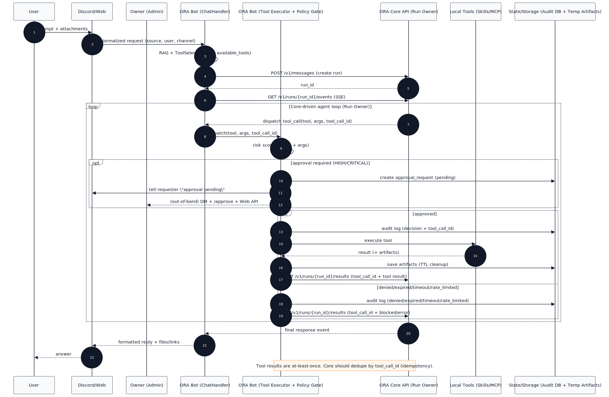

<div align="center">

# ORA (v5.1.14-Singularity) 🌌
### **The Artificial Lifeform AI System (Discord Bot + Web + Core)**


[](https://github.com/YoneRai12/ORA/releases)
[](https://github.com/YoneRai12/ORA/actions/workflows/test.yml)
[](https://discord.gg/YoneRai12)
[](LICENSE)

[**[Manual]**](docs/USER_GUIDE.md) | [**[Env Templates]**](docs/ENV_FILES.md) | [**[Release Notes]**](docs/RELEASE_NOTES.md) | [**[Web Chat]**](http://localhost:3000) | [**[Dashboard]**](http://localhost:3333)

---

[**English**](README.md) | [日本語](README_JP.md)

</div>

---

## What Is ORA?

ORA is a local-first AI platform built around a Discord bot, a web admin server, and an optional Core process.
It supports tool/skill execution with risk scoring + approvals, and can be extended via MCP (Model Context Protocol) tool servers.

If you want the deep docs:
- `docs/USER_GUIDE.md`
- `docs/SYSTEM_ARCHITECTURE.md`
- `docs/PLATFORM_PLAN.md` (product direction: Node + Clients + Relay + Cloud)
- `docs/PLATFORM_REVIEW_AND_RISKS.md` (devil's advocate review / risks)
- `ORA_SYSTEM_SPEC.md`
- `AGENTS.md` (Codex/agent workspace instructions for this repo)

---

## Components

- Bot process (Discord): `python main.py`
- Admin server (FastAPI): `uvicorn src.web.app:app --host 0.0.0.0 --port 8000`
- Core (optional): `python -m ora_core.main` (see below)
- Web Chat UI (Next.js): `clients/web/` (default `http://localhost:3000`)
- Dashboard UI (Next.js): `ora-ui/` (default `http://localhost:3333`)

---

## Quickstart (Windows)

Prereqs:
- Python 3.11
- Node.js (for `clients/web`, `ora-ui`, and some skills)
- FFmpeg on `PATH` (voice/music and some media skills)

### 1) Bot
```powershell
python -m venv .venv
.venv\Scripts\Activate.ps1
pip install -U pip
pip install -r requirements.txt
Copy-Item .env.example .env
python main.py
```

Minimum required env var: `DISCORD_BOT_TOKEN`.

### 2) Admin Server (optional)
```powershell
.venv\Scripts\Activate.ps1
uvicorn src.web.app:app --reload --host 0.0.0.0 --port 8000
```

### 3) Web UIs (optional)
```powershell
cd clients\web
npm install
npm run dev
```

```powershell
cd ora-ui
npm install
npm run dev
```

### 4) Core (optional)
```powershell
$env:PYTHONPATH = "core\src"
python -m ora_core.main
```

Notes:
- `start_all.bat` is a convenience launcher, but it contains machine-specific paths. Treat it as an example to adapt.

---

## Configuration (.env)

Start from `.env.example`.

Required:
- `DISCORD_BOT_TOKEN`

Recommended:
- `DISCORD_APP_ID` (Application ID)
- `ORA_DEV_GUILD_ID` (dev guild sync is immediate; global sync can take up to ~1 hour)
- `ADMIN_USER_ID` (owner/creator identity)

Feature toggles you likely care about:
- `OPENAI_API_KEY` (cloud models)
- `LLM_BASE_URL`, `LLM_MODEL` (local gateway)
- `ORA_PUBLIC_TOOLS`, `ORA_SUBADMIN_TOOLS` (tool allowlists)
- `ORA_APPROVAL_TIMEOUT_SEC` and audit retention settings (approvals + audit logs)

---

## Skills (Local Tools)

ORA supports two local mechanisms that are both executed through the same ToolHandler boundary:

- Static tool registry: `src/cogs/tools/registry.py`
  - Built-in tools with an implementation path like `src.cogs.tools.web_tools:navigate`.
- Dynamic skills: `src/skills/<skill_name>/`
  - Self-describing skills in the "Clawdbot pattern": `SKILL.md` + `tool.py` (+ optional `schema.json`).
  - Loaded by `src/skills/loader.py` and executed by `src/cogs/tools/tool_handler.py`.

Skill folder shape:
- `src/skills/<name>/SKILL.md` (usage + requirements)
- `src/skills/<name>/tool.py`
  - `async def execute(args: dict, message: discord.Message, bot: Any = None) -> Any`
  - optional `TOOL_SCHEMA = {name, description, parameters, tags}`

Example skill:
- `src/skills/remotion_create_video/` (requires Node deps in `tools/remotion/`)

### Remotion (Video Rendering)

Skill: `remotion_create_video`

Setup (one-time):
```powershell
cd tools/remotion
npm ci
```

Notes:
- Requires Node.js + `npx` on `PATH`.
- Optional env vars: `ORA_REMOTION_PROJECT_DIR`, `ORA_REMOTION_ENTRY`, `ORA_REMOTION_RENDER_TIMEOUT_SEC`.

---

## MCP (Model Context Protocol) Tool Servers

MCP support is **disabled by default**. When enabled, ORA connects to configured MCP servers via stdio and registers each remote tool as a local ORA tool:

- Tool name format: `mcp__<server>__<tool>`
- Loader: `src/cogs/mcp.py`
- Transport: `src/utils/mcp_client.py` (minimal MCP-over-stdio client)

Enable MCP:
```ini
ORA_MCP_ENABLED=1
# JSON array of servers
# Each entry supports: name, command, cwd, env, allowed_tools, allow_dangerous_tools
ORA_MCP_SERVERS_JSON=[{"name":"artist","command":"python scripts/mock_mcp_artist.py","allowed_tools":["generate_artwork"]}]
```

Alternatively, configure `mcp_servers` in `config.yaml` (same object shape) instead of `ORA_MCP_SERVERS_JSON`.

Hardening knobs:
- `ORA_MCP_DENY_TOOL_PATTERNS` (default denies common destructive/execution-ish names)
- `ORA_MCP_ALLOW_DANGEROUS=0` (keep deny patterns enforced)

---

## Safety (Risk Scoring, Approvals, Audit)

- Risk scoring: `src/utils/risk_scoring.py`
- Approvals gate: `src/cogs/tools/tool_handler.py` (risk-based approval before execution)
- Audit DB: `ora_bot.db` (retention controlled by `.env` variables like `ORA_AUDIT_RETENTION_DAYS`)

---

## Current System Flow (Hub + Spoke)

ORA currently runs as a hub/spoke agent pipeline:
- `ChatHandler` (Discord/Web thin client) builds context, attachments, and a filtered tool list.
- `ORA Core API` owns the reasoning loop and emits tool calls.
- The bot executes tools locally and submits results back to Core.

### End-to-End Request Path (Sequence)


Mermaid source: `docs/diagrams/e2e_request_path_sequence_en.mmd`

---

## Dev Checks (Same As CI)

```bash
python -m venv .venv
source .venv/bin/activate  # Windows: .venv\\Scripts\\activate
pip install -U pip
pip install -r requirements.txt
pip install ruff mypy pytest pytest-asyncio

ruff check .
mypy src/ --ignore-missing-imports
python -m compileall src/
pytest
```

---

## Release/Tag Rules

1. Update `VERSION` using SemVer (`X.Y.Z`).
2. Update changelog entries.
3. Create a git tag as `vX.Y.Z` and push it.

```bash
python scripts/verify_version.py --tag v5.1.8
git tag v5.1.8
git push origin v5.1.8
```

---

## Contributing

- No hardcoded API keys.
- Keep tool schemas accurate (skills + MCP tools rely on schemas/tags for routing and risk scoring).

---

## License

MIT. See `LICENSE`.
