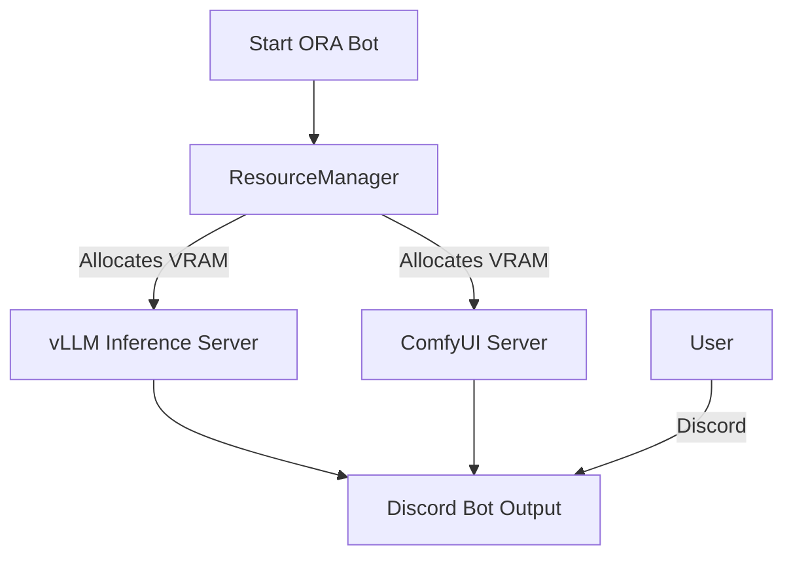

# ORA Discord Bot - Ultimate Edition 🌌
### *The Next-Generation AI Orchestrator for RTX 5090*

---

## 🚀 Overview

ORA is a **fully autonomous AI Operating System** running locally on your hardware. It integrates the world's most advanced open-source models into a seamless, unified experience inside Discord.

### ✨ Highlights
- **🧠 Dual-Brain Architecture**: Automatically switches between a fast "Instruct Model" (Qwen3-VL-30B) for chat/vision and a deep "Reasoning Model" (Thinker) for math/logic.
- **👁️ True Vision (Multimodal)**: Can see video and images with human-level understanding (powered by Qwen & SAM 3).
- **🎨 Hollywood-Grade Art**: Generates 4K images using **FLUX.2** ensuring photo-realism and style adherence.
- **🗣️ Human-Like Voice**: Listens to you in VC (Faster-Whisper) and speaks back (T5Gemma/VoiceVox).
- **⚡ Zero-Latency Gaming**: Automatically detects when you play games (Valorant/Apex) and hot-swaps to a lightweight model to save FPS.

ORA operates on a sophisticated **5-Layer Stack** designed for the RTX 5090 (32GB VRAM).

1.  **Launcher Layer** (`start_vllm.bat`): Orchestrates boot, environment checks, and crash recovery.
2.  **Resource Layer** (`ResourceManager`): The "Guard Dog". Monitors VRAM and enforces **Exclusive Context** to prevent OOM.
3.  **Inference Layer**:
    -   **vLLM**: Serving Qwen3-VL-30B (A3B/AWQ).
    -   **ComfyUI**: Serving FLUX.2 (FP8).
4.  **Application Layer**: Python Discord Bot & FastAPI.
5.  **Interface Layer**: Discord Client & Web Dashboard (`ora-ui`).

---

## 💻 Installation & Usage

### One-Click Launch
1.  **Right-Click** on your Desktop -> **"Start ORA Bot"**.
2.  Wait 3 seconds. The system auto-initializes all 5 layers.

### Manual Modes
If launching via `start_vllm.bat`:
- **[1] Normal**: Full power (30B Model). Best for everything.
- **[2] Thinking**: Forces the Reasoning model.
- **[3] Gaming**: Low-VRAM mode (7B Model) for playing heavy games.

---

## ⚙️ Configuration & Customization

You can tweak ORA's behavior in `src/config.py` or `.env`.

### Environment Variables
| Variable | Description | Default |
| :--- | :--- | :--- |
| `ORA_DEV_GUILD_ID` | Server ID for Slash Commands (Global if empty) | None |
| `SD_API_URL` | URL for ComfyUI/SD Backend | `http://localhost:8188` |
| `LLM_API_URL` | URL for vLLM Backend | `http://localhost:8001/v1` |
| `VOICEVOX_URL` | URL for TTS Engine | `http://localhost:50021` |

### Specialized Models
ORA supports "Lazy Loading" for these heavy models (only loaded when used):
- **SAM 3 (Segment Anything)**: Place official repo in `L:\ai_models\github\sam3`.
- **T5Gemma TTS**: Place resources in `L:\ai_models\huggingface\Aratako_...`.

---

## 📚 Detailed Command List

### 🎨 Image Generation
`/imagine [prompt] [style] [resolution]`
-   **Prompt**: "A cyberpunk city at night".
-   **Style**: "Anime", "Photo", "Oil Painting" (Auto-detected if omitted).
-   **Resolution**: FHD, 4K, Ultrawide.
> **Note**: ORA uses FLUX.2, which follows prompts *exactly*.

### 👁️ Vision Analysis
`/analyze [image/video]`
-   Upload a file and ask "What is happening here?".
-   Use "Solve this" for math homework.
-   Use "Who is this?" for character recognition.

### 🗣️ Voice System
`/join` / `/leave`
-   Bot joins Voice Chat.
-   **Auto-Read**: Reads chat messages via TTS.
-   **Listen Mode**: (`/listen`) Talk to ORA directly. She hears you!

### 🔧 Tools & Utilities
-   `/search`: Google Search.
-   `/timer`: Set alarms.
-   `/system`: VRAM/Temp monitor.
-   `/shiritori`: Play games.

---

## ❓ Troubleshooting

### "System Swapping / Laggy"
-   **Cause**: vLLM default VRAM reservation (90%) leaves no room for Windows.
-   **Fix**: Launcher sets `gpu-memory-utilization` to 0.60 (60%), fixing this. Restart the bot.

### "Bot starts but vLLM stops"
-   **Cause**: Port conflict. Bot tries to start its own vLLM.
-   **Fix**: Fixed in `ResourceManager` (Startup Adoption). Restart the bot.

### "Image Generation Failed"
-   **Cause**: ComfyUI not running.
-   **Fix**: Use the "Start ORA Bot" launcher (it starts Comfy automatically).

---

**Developed by YoneRai12**
*Powered by the Bleeding Edge of AI*

