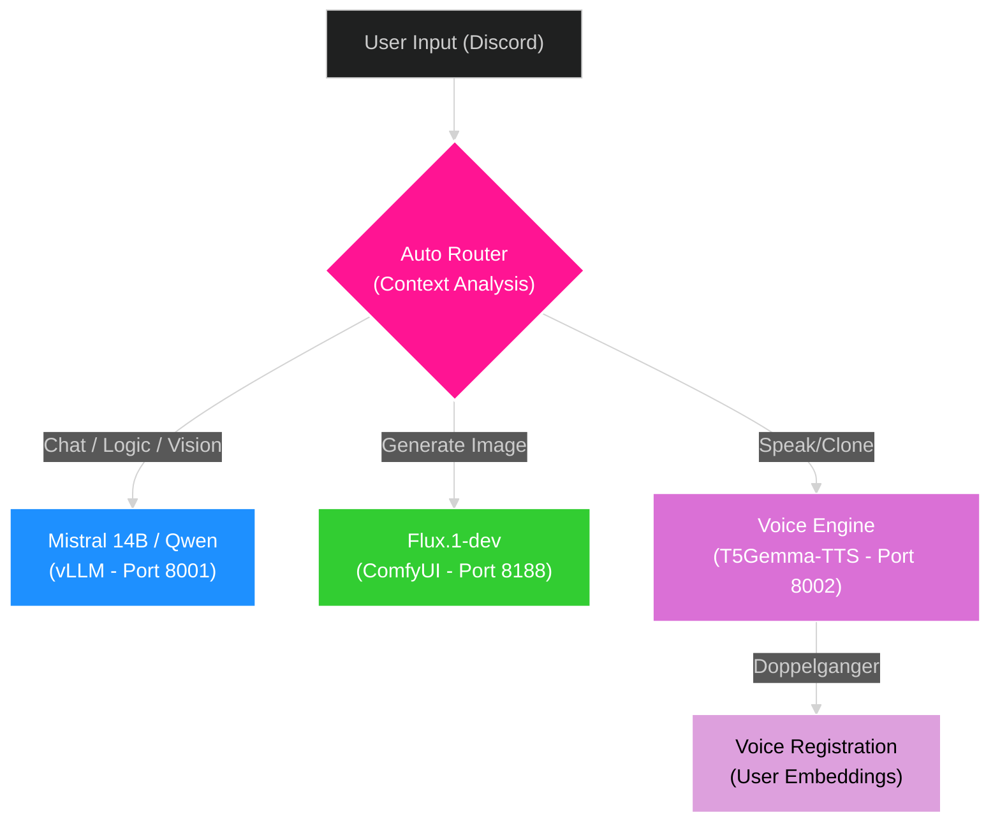

# ORA Discord Bot - Ultimate Edition 🌌
### *The Next-Generation AI Orchestrator for RTX 5090*

<div align="center">


[](https://discord.gg/YoneRai12)
[](https://www.python.org/)
[](https://github.com/vllm-project/vllm)
[](https://www.nvidia.com/)


<div align="center">

[](README.md)
[](README_JP.md)

</div>

</div>

---

## 🚀 Overview

ORA is a **fully autonomous AI Operating System** running locally on your hardware. It integrates the world's most advanced open-source models into a seamless, unified experience inside Discord.

### ✨ Why ORA? (Key Benefits)
- **💰 Zero Monthly Fees**: Unlike ChatGPT Plus ($20/mo) or Midjourney ($10/mo), ORA runs **100% locally**. You own the AI.
- **🔒 Complete Privacy**: No data leaves your PC. Your chats, images, and voice are processed on your RTX 5090.
- **⚡ High Performance**: Optimized for RTX 5090 (32GB VRAM), ensuring maximum speed and quality.

### 🌟 Technical Highlights
- **🧠 Dual-Architecture (Brain + Voice)**: 
    - **Main Brain**: `Ministral-3-14B` via **vLLM** (Logic, Tools, Vision).
    - **Voice Engine**: `T5Gemma-TTS` via **Services** (Voice Cloning, Speech).
- **🗣️ Doppelganger Mode**: Can clone and speak with YOUR voice (Zero-Shot Cloning).
- **👁️ True Vision (Native)**: Can see video and images directly through the Main Brain.
- **🎨 Hollywood-Grade Art**: Generates 4K images using **FLUX.2** (State of the Art).
- **🎮 Zero-Latency Gaming**: Automatically detects games (Apex/Valorant) and shrinks VRAM usage to save FPS.

---

## 💡 Practical Use Cases

| Scenario | How ORA Helps |
| :--- | :--- |
| **🤖 Gaming Companion** | "Hey ORA, look at my screen. Where is the enemy?" (Vision) |
| **🎨 Creative Studio** | "Generate a Youtube thumbnail for Minecraft, anime style." (Image Gen) |
| **👯 Doppelganger** | "Clone my voice from this audio file." (Voice Cloning) |
| **🎙️ Vtuber / Stream** | Can act as a fully voiced co-host that reads chat and responds. |
| **🔍 Research** | "Search the web for RTX 5090 benchmarks and summarize." (Tools) |


## 🏗️ System Architecture (Logic Flow)

This system uses a **Service-Oriented Architecture** to prevent crashes.



---

## 💻 Installation & Usage

### 1. Model Setup (First Time)
Run the downloader to fetch the Voice Engine weights (~10GB):
```powershell
python download_triad_models.py
```

### 2. Launching ORA
1.  **Start Services**: Double-click `start_services.bat`.
    -   Launches **Voice Engine** (T5Gemma).
2.  **Start Launcher**: Right-Click Desktop -> **"Start ORA Bot"**.
    -   Launches **vLLM** (Brain) and **ComfyUI** (Image).

### Manual Modes
If launching via `start_vllm.bat`:
- **[1] Normal**: Full power (Mistral/Qwen 30B).
- **[2] Thinking**: Forces Reasoning model.
- **[3] Gaming**: Low-VRAM mode (7B Model).

---

## 📚 Detailed Command List

### 🗣️ Voice & Cloning
`/join` / `/leave`
-   **Auto-Read**: Reads chat messages via TTS.
-   `/doppelganger [audio]`: **Registers your voice.** ORA will start speaking with YOUR voice.

### 🎨 Image Generation
`/imagine [prompt] [style] [resolution]`
-   **Prompt**: "A cyberpunk city at night".
-   **Style**: "Anime", "Photo", "Oil Painting" (Auto-detected if omitted).
-   **Resolution**: FHD, 4K, Ultrawide.

### 👁️ Vision Analysis
`/analyze [image/video]`
-   Upload a file and ask "What is happening here?".
-   Use "Solve this" for math homework.

---

## 🏗️ Phase 18: Tool Mastery (LoRA Training)

ORA is learning to use tools natively without prompts.

### 🎯 Training Objective
Fine-tuning the 14B model to output correct JSON tool calls for:
1.  `generate_image` (Flux)
2.  `web_search` (Google)
3.  `doppelganger` (Voice Cloning)

### 🚀 How to Train
1.  **Generate Data**:
    ```powershell
    python src/training/prepare_tool_data.py
    ```
2.  **Start Training** (RTX 5090):
    ```powershell
    cd RTX5090-DebugSystem-main
    start_training.bat
    ```

---

<div align="center">

**Developed by YoneRai12**
*Powered by the Bleeding Edge of AI*

</div>
