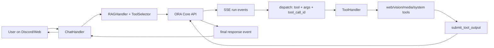

<div align="center">

# ORA (v5.0-Singularity) 🌌
### **The Artificial Lifeform AI System for High-End PC**


[](https://github.com/YoneRai12/ORA/releases)
[](https://github.com/YoneRai12/ORA/actions/workflows/test.yml)
[](https://discord.gg/YoneRai12)
[](LICENSE)

[**[📖 Manual]**](docs/USER_GUIDE.md) | [**[📂 Releases]**](https://github.com/YoneRai12/ORA/releases) | [**[🌐 Dashboard]**](http://localhost:3000)

---

[**English**](README.md) | [日本語](README_JP.md)

</div>

---

## 📖 What is ORA?

ORA is no longer just a "Bot". It is a **Living AI Operating System** that inhabits your high-end PC.
Designed to push the **RTX 5090** to its limits, she combines self-healing code, autonomous evolution, and multimodal vision into a single, seamless personal AI experience.

### 🚀 Key Features

*   **⚡ Hybrid Intelligence**: Intelligent routing between **Qwen 2.5-VL** (Fast Local) and **GPT-5.1** (Deep Cloud Reasoning).
*   **🧬 Auto-Healer**: When ORA encounters an error, she writes her own Python patch and hot-reloads herself.
*   **👁️ True Vision**: Real-time desktop/gameplay analysis via advanced Vision Transformers.
*   **🔒 Privacy First**: Your data stays on your machine. PII is handled exclusively by local models.

### 📊 Module Readiness Status

| Category | Component | Status | Description |
| :--- | :--- | :--- | :--- |
| **Thinking** | Omni-Router (Intent) | ✅ Stable | Context-aware brain routing |
| **Visual** | Vision / OCR | ✅ Stable | Real-time screen capture & analysis |
| **System** | Auto-Healer | 🛠️ In-Dev | Self-repair & GitHub sync logic |
| **Media** | Image Gen / Video | ✅ Stable | Local FLUX.2 / yt-dlp integration |
| **Platform** | Windows / Mac / Web | ✅ Active | Multi-frontend ecosystem support |

---

## 🔥 The "Big Three" Core Pillars

### 1. 🧬 Immortal Code (Self-Healing)
**"I fell down, but I fixed my leg and stood up. I am stronger now."**

Most software crashes when it hits a bug. ORA treats bugs as **learning opportunities**.
When a runtime error occurs (e.g., specific API failure), ORA:
1.  **Freezes** the crash state.
2.  **Analyzes** the traceback with her Logic Brain (GPT-5/4o).
3.  **Writes a Patch**: She edits her own `.py` source code locally.
4.  **Hot-Reloads**: She restarts *only* the broken component (Cog) without disconnecting from Voice.

> *Result: You can leave ORA running for months, and she will theoretically become more stable over time.*

### 2. 🧠 Current System Flow (Hub + Spoke)
ORA currently runs as a **Hub/Spoke agent pipeline**:
- `ChatHandler` (Discord/Web thin client) builds context, attachments, and selected tool schemas.
- `ORA Core API` (`/v1/messages`, `/v1/runs/{id}/events`) owns the reasoning loop.
- Tool calls are dispatched to the client, executed locally, then submitted back to Core via `/v1/runs/{id}/results`.
- Core resumes reasoning with tool outputs and emits the final answer.

### 🔄 End-to-End Request Path


### 🏗️ Runtime Architecture (Current)
```mermaid
flowchart TD
    subgraph Client["Client Layer"]
        CH[ChatHandler]
        VH[VisionHandler]
        TS[ToolSelector]
        RH[RAGHandler]
        TH[ToolHandler]
    end

    subgraph Core["Core Layer"]
        MSG[/POST /v1/messages/]
        RUN[MainProcess loop]
        EV[/GET /v1/runs/{id}/events/]
        RES[/POST /v1/runs/{id}/results/]
        DB[(SQLite: runs/messages/tool_calls)]
    end

    CH --> VH
    CH --> TS
    CH --> RH
    CH --> MSG
    MSG --> RUN
    RUN --> DB
    RUN --> EV
    EV --> CH
    CH --> TH
    TH --> RES
    RES --> RUN
```

### Routing & Tooling Notes (As Implemented)
1. Platform metadata (`source`, guild/channel context, admin flags) is injected before Core call.
2. Complexity-aware routing is done in `ToolSelector`; high-complexity tasks can force plan-first behavior.
3. Vision attachments are normalized and sent in canonical `image_url` shape for cloud models.
4. `web_download` supports Discord size-aware delivery and temporary 30-minute download pages.
5. CAPTCHA/anti-bot pages are detected and handled by strategy switch, not bypass attempts.

### 3. 👥 Shadow Clone (Zero Downtime)
Updates usually mean "Downtime". Not for ORA.
When ORA needs to restart (for an update or self-healing), she spawning a **"Shadow Clone"** (Watcher Process).
*   The Shadow keeps the Voice Connection alive.
*   The Main Body dies, updates, and reborns.
*   **Crash Safety**: If the Shadow detects configuration errors (missing tokens), it forcefully kills itself to prevent zombie processes.

---

## 👁️ True Multimodal I/O (The "Senses")

ORA processes the world through **Images**, **Sound**, and **Text**.

### 1. Vision (The Eyes) 🖼️
ORA uses **Qwen 2.5-VL (Visual Language Model)** or **GPT-5-Vision** to "see" images.
*   **Screenshot Analysis**: Share a screenshot of your game or code, and she understands it.

### 2. Audio (The Ears & Voice) 🎤
*   **Multi-User Recognition**: ORA distinguishes *who* is speaking within 0.2s.
*   **Dynamic Tone**: Through prompt engineering, she acts as distinct personas (e.g., Tsundere, Maid) that you configure.

### 3. Generation (The Hands) 🎨
ORA creates content locally.
*   **Image Generation**: Uses **FLUX.2** or **Stable Diffusion XL** locally.

---

## 🛡️ NERV User Interface
A dedicated Web Dashboard (`http://localhost:3000`) for monitoring ORA's brain.
*   **Hex-Grid Visualizer**: See the status of every module.
*   **Memory Explorer**: View what ORA remembers about you.
*   **Process Killer**: One-click "Gaming Mode" to kill background bloatware and free up VRAM.

---

## ⚙️ Configuration Bible (.env)

| Variable | Description |
| :--- | :--- |
| `DISCORD_BOT_TOKEN` | **Required**. Your Bot Token. |
| `ADMIN_USER_ID` | **Required**. Your Discord User ID. |
| `OPENAI_API_KEY` | Optional. Required if using `gpt-*` models. |
| `LLM_BASE_URL` | Endpoint for Local LLM (Default: `http://localhost:8001/v1`). |
| `GAMING_PROCESSES` | Process names that trigger Gaming Mode (Low VRAM usage). |

---

## 🔁 Reproducible Setup & Versioning

### Local Repro Steps (same as CI)
```bash
python -m venv .venv
source .venv/bin/activate  # Windows: .venv\\Scripts\\activate
pip install -U pip
pip install -r requirements.txt
pip install ruff mypy pytest pytest-asyncio

ruff check .
mypy src/ --ignore-missing-imports
python -m compileall src/
pytest tests/test_smoke.py
```

### Release/Tag Rules
1. Update `VERSION` using SemVer (`X.Y.Z`).
2. Update changelog entries.
3. Create a git tag as `vX.Y.Z` and push it.

```bash
python scripts/verify_version.py --tag v5.0.0
git tag v5.0.0
git push origin v5.0.0
```

`release.yml` now fails if tag and `VERSION` do not match, so others can reproduce the same release artifact.

---

## 🤝 Contributing
1.  **Fork** the repository.
2.  **Create** a feature branch.
3.  **Commit** your changes.
4.  **Open a PR**.

**Rules:**
*   No hardcoded API keys.
*   Run `tools/debug/check_transformers.py` before submitting.

---

## 📜 License
Project ORA is licensed under **MIT License**.
You own your data. You own your intelligence.

<div align="center">

**Architected by YoneRai12**
*A project to blur the line between Software and Life.*

</div>
