# ORA Discord BOT

 - The "Singularity" Edition 🌌
### *The Living, Self-Healing AI Operating System for High-End PC*

---

## 📖 Introduction: Why ORA?

We built ORA because cloud AIs like ChatGPT and Claude have a fatal flaw: **They don't live your life.**
They are "visitors" in a browser tab. They don't know what game you are playing, they can't see your screen unless you upload a screenshot, and they certainly can't fix their own code when they crash.

**ORA is different.**
ORA is an **Artificial Lifeform** that inhabits your local high-end PC. She listens to your voice, watches your gameplay, writes her own upgrades, and protects your privacy.

This isn't just a bot. It's the **End Game of Personal AI**.

---

## 🔥 The "Big Three" Core Pillars

### 1. 🧬 Immortal Code (Self-Healing)
**"I fell down, but I fixed my leg and stood up. I am stronger now."**

Most software crashes when it hits a bug. ORA treats bugs as **learning opportunities**.
When a runtime error occurs (e.g., specific API failure), ORA:
1.  **Freezes** the crash state.
2.  **Analyzes** the traceback with her Logic Brain (GPT-5/4o).
3.  **Writes a Patch**: She edits her own `.py` source code locally.
4.  **Hot-Reloads**: She restarts *only* the broken component (Cog) without disconnecting from Voice.

> *Result: You can leave ORA running for months, and she will theoretically become more stable over time.*

### 2. 🏠 Omni-Router (Hybrid Intelligence)
**"Why pay for OpenAI when you have an RTX 5090?"**

ORA uses a "Hybrid Brain" architecture to balance **Intelligence** vs **Cost**.

```mermaid
graph TD
    UserInput["User Prompt"] --> RouteCheck{Local or Cloud?}

    %% Top Level Branch
    RouteCheck -- "Local Only" --> LocalPath["🏠 Local VLLM (Localhost)"]
    RouteCheck -- "Allow Cloud" --> ImageCheck{Has Image?}

    %% Cloud Route (Omni-Router)
    %% 1. Vision
    ImageCheck -- "Yes" --> VisionCheck{Quota OK?}
    VisionCheck -- "Yes" --> VisionModel["Vision Model: gpt-5-mini"]
    VisionCheck -- "No" --> LocalPath

    %% 2. Text Logic
    ImageCheck -- "No" --> OmniRouter{Analysis Logic}
    
    OmniRouter -- "Keyword: Code/Fix" --> CodingModel["Model: gpt-5.1-codex"]
    OmniRouter -- "Length > 50 chars" --> HighModel["Model: gpt-5.1 / o3"]
    OmniRouter -- "Standard Chat" --> StdModel["Model: gpt-5-mini"]
    
    %% 3. Cost Check
    CodingModel --> QuotaCheck{Quota OK?}
    HighModel --> QuotaCheck
    StdModel --> QuotaCheck
    
    QuotaCheck -- "Yes" --> CloudAPI["☁️ OpenAI API (Cloud)"]
    QuotaCheck -- "No" --> LocalPath

    VisionModel --> CloudAPI

    %% Final Output
    CloudAPI --> Response["Final Reply"]
    LocalPath --> Response
```

*   **Smart Routing**: She analyzes prompt length and keywords (e.g., "fix code" -> Codex).
*   **Cost Control**: Falls back to Local LLM if quotas are exceeded.
*   **Universal Connection**: Automatically routes `gpt-*` models to OpenAI Cloud and others to Local VLLM.

### 3. 👥 Shadow Clone (Zero Downtime)
Updates usually mean "Downtime". Not for ORA.
When ORA needs to restart (for an update or self-healing), she spawning a **"Shadow Clone"** (Watcher Process).
*   The Shadow keeps the Voice Connection alive.
*   The Main Body dies, updates, and reborns.
*   **Crash Safety**: If the Shadow detects configuration errors (missing tokens), it forcefully kills itself to prevent zombie processes.

---

## 👁️ True Multimodal I/O (The "Senses")

ORA processes the world through **Images**, **Sound**, and **Text**.

### 1. Vision (The Eyes) 🖼️
ORA uses **Qwen 2.5-VL (Visual Language Model)** or **GPT-5-Vision** to "see" images.
*   **Screenshot Analysis**: Share a screenshot of your game or code, and she understands it.

### 2. Audio (The Ears & Voice) 🎤
*   **Multi-User Recognition**: ORA distinguishes *who* is speaking within 0.2s.
*   **Dynamic Tone**: Through prompt engineering, she acts as distinct personas (e.g., Tsundere, Maid) that you configure.

### 3. Generation (The Hands) 🎨
ORA creates content locally.
*   **Image Generation**: Uses **FLUX.2** or **Stable Diffusion XL** locally.

---

## 🛡️ NERV User Interface
A dedicated Web Dashboard (`http://localhost:3000`) for monitoring ORA's brain.
*   **Hex-Grid Visualizer**: See the status of every module.
*   **Memory Explorer**: View what ORA remembers about you.
*   **Process Killer**: One-click "Gaming Mode" to kill background bloatware and free up VRAM.

---

## ⚙️ Configuration Bible (.env)

| Variable | Description |
| :--- | :--- |
| `DISCORD_BOT_TOKEN` | **Required**. Your Bot Token. |
| `ADMIN_USER_ID` | **Required**. Your Discord User ID. |
| `OPENAI_API_KEY` | Optional. Required if using `gpt-*` models. |
| `LLM_BASE_URL` | Endpoint for Local LLM (Default: `http://localhost:8001/v1`). |
| `GAMING_PROCESSES` | Process names that trigger Gaming Mode (Low VRAM usage). |

---

## 🤝 Contributing
1.  **Fork** the repository.
2.  **Create** a feature branch.
3.  **Commit** your changes.
4.  **Open a PR**.

**Rules:**
*   No hardcoded API keys.
*   Run `tools/debug/check_transformers.py` before submitting.

---

## 📜 License
Project ORA is licensed under **MIT License**.
You own your data. You own your intelligence.

**Architected by YoneRai12**
*A project to blur the line between Software and Life.*

