# ORA Discord Bot - Ultimate Edition 🌌
### *The Self-Healing, Hybrid AI Operating System for RTX 5090*

<div align="center">


[](https://discord.gg/YoneRai12)
[](https://www.python.org/)
[](src/config.py)
[](src/utils/healer.py)
[](https://www.nvidia.com/)

<div align="center">

[](README.md)
[](README_JP.md)

</div>

</div>

---

## 🤯 The Singularity Architecture (v4.2)

ORA is no longer just a "Bot". It has evolved into a **Living AI Operating System**.
Unlike standard bots that crash on error, ORA **re-writes her own code** to fix bugs. Unlike cloud bots, ORA **sees your screen** and **controls your PC** locally.

### ✨ Why ORA? (The RTX 5090 Advantage)

| Feature | Details |
| :--- | :--- |
| **💰 Zero Fees** | Unlike ChatGPT Plus ($20/mo), ORA runs **100% locally**. You own the Intelligence. |
| **🔒 Absolute Privacy** | No data leaves your PC. Your chats, images, and voice are processed on your hardware. |
| **🧬 Self-Healing** | If a crash occurs, ORA analyzes the stack trace, writes a python patch, and hot-reloads instantly. |
| **⚡ Hybrid Brain** | Uses **Qwen 2.5-VL 32B** (Local) for speed/vision, and **GPT-5.1** (Cloud) for complex coding. |

---

## 🆕 Latest Update: v4.2 (2026/01/10)
### 🛡️ Ultimate Security & NERV UI
*   **Zero Hardcoded Secrets**: Complete migration to `.env` architecture. GitHub Ready.
*   **NERV Red Alert**: The Dashboard now reacts to "Admin Override" with a dynamic Hex-Grid Emergency visualization (Code: `ora-ui/app/dashboard`).
*   **System Telemetry**: Real-time monitoring of "Core System Connection" and "Root Injection" sequences.

---

## 🧬 Biological Systems (Deep Dive)

### 1. The Auto-Healer Engine
**"Software that repairs itself."**
This system is strictly implemented in `src/utils/healer.py`.

```mermaid
graph TD
    Error[🔥 Runtime Error] --> Intercept{Healer Intercept}
    Intercept --> Analysis[🧠 GPT-5 Diagnosis]
    Analysis --> Patch[📝 Code Generation]
    Patch --> Audit{🛡️ Security Audit}
    
    Audit -->|Pass| Apply[💉 Inject Code]
    Apply --> Reload[🔄 Hot Reload Cog]
    Reload --> Verify[✅ System Healed]
    
    style Error fill:#ff0000,stroke:#fff
    style Verify fill:#00ff00,stroke:#000
```



### 2. Genetic Self-Evolution
You don't wait for updates. **You ask for them.**
*   *User*: "Add a crypto price checker."
*   *ORA*: Analyzes `src/cogs/`, writes `crypto.py`, loads it, and registers `/crypto`.
*   *Status*: **Active** (Permissions managed via `ADMIN_USER_ID`).

### 3. Satellite Architecture (Sub-PC)
**"My Main PC is sleeping, but ORA is awake."**
Run ORA's "Ear" on a Mac/N100 to save power, and wake the Beast (RTX 5090) only when needed.

---

## 🧠 Brain & Logic Specs

The **Omni-Router** (`config.py`) dynamically assigns tasks to the optimal brain.

| Function | Engine / Model | Location | Status |
| :--- | :--- | :--- | :--- |
| **Logic Core** | **Qwen 2.5-VL 32B** | Local (vLLM) | 🟢 Active |
| **Vision Eyes** | **Qwen Native Vision** | Local (Monitor) | 🟢 Active |
| **High Logic** | **GPT-5.1-Codex** | Cloud (OpenAI) | 🟢 Active |
| **Creative Art** | **FLUX.2 (FP8)** | Local (ComfyUI) | 🟢 Active |
| **Voice Cloning** | **T5Gemma-TTS** | Local (Port 8002) | 🟢 Active |

### 🔄 Logic Flow

```mermaid
graph TD
    Input[Input Request] --> Router{Omni-Router}
    
    Router -->|Reflex / Vision| Qwen["🏠 Qwen 2.5 VL (Local)"]
    Router -->|Complex Coding| Cloud["☁️ GPT-5.1 (Cloud)"]
    
    Qwen --> Response
    Cloud --> Response
    
    Qwen --> Tools["🛠️ Real-World Tools"]
    Tools --> Image["🎨 FLUX.2 Image"]
    Tools --> System["💻 PC Control (WOL/Shutdown)"]
    Tools --> Healer["🧬 Code Patching"]
    
    style Router fill:#ff0055,stroke:#fff
    style Qwen fill:#00aaff,stroke:#fff
    style Tools fill:#ffaa00,stroke:#000
```


---

## 💻 NERV-Style Dashboard
The Web Dashboard (`ora-ui`) provides a sci-fi interface to monitor ORA's internal state.
*   **Thought Visualization**: See exactly which model is thinking and why.
*   **Gaming Mode**: Automatically kills background processes (Valorant, FFXIV) to free VRAM.


---

## 📚 Technical Deep Dive & Manuals

### 📘 For Users
*   **[📖 User Manual & Command Guide](docs/USER_GUIDE.md)**: **Start Here**. How to use `@ORA`, slash commands, and the Dashboard.

### 🏗️ For Engineers
**Warning: These documents contain extreme levels of detail.**
*   **[🏗️ System Architecture](docs/SYSTEM_ARCHITECTURE.md)**: The internal schematics of the Omni-Router and IPC.
*   **[🧬 Auto-Healer Architecture](docs/AUTO_HEALER.md)**: How the bot rewrites its own python code at runtime.
*   **[🧠 Hybrid Brain Logic](docs/HYBRID_BRAIN.md)**: Qwen 2.5 vs GPT-5.1 routing and cost management.
*   **[💻 NERV Dashboard Internals](docs/NERV_DASHBOARD.md)**: React/Next.js implementation of the Red Alert system.
*   **[🛰️ Satellite (Sub-PC) System](docs/SATELLITE_SYSTEM.md)**: Wake-on-LAN protocols and hardware handover.

## �️ Installation & Config

### 1. Setup
```bash
# Clone the repository
git clone https://github.com/YoneRai12/ORA.git

# Install dependencies
pip install -r requirements.txt
```

### 2. Configuration (.env)
We have removed all hardcoded IDs. You MUST configure `.env`.
```ini
DISCORD_BOT_TOKEN=your_token
ADMIN_USER_ID=your_id
LLM_MODEL=Qwen/Qwen2.5-VL-32B-Instruct-AWQ
ORA_LOG_CHANNEL_ID=0
```

### 3. Ignite
*   **Double-Click**: `start_launcher.py` (Windows) or `Double_Click_To_Start.command` (Mac).
*   **Voice Engine**: Starts automatically on Port 8002.

---

## � Future Roadmap (Phase 21)
*   **God's Eye v2**: Real-time 30FPS desktop streaming analysis.
*   **3D Alchemy**: Generating Minecraft items from images via TRELLIS.2.
*   **Infinite Personas**: ELYZA-style LoRA switching.

<div align="center">

**Architected by YoneRai12**
*The Future is Local.*

</div>
