# ORA Discord BOT
[](https://github.com/YoneRai12/ORA/actions/workflows/test.yml)
 - The "Singularity" Edition 🌌
### *The Living, Self-Healing AI Operating System for High-End PC*

<div align="center">


[](https://discord.gg/YoneRai12)
[](https://www.python.org/)
[](src/config.py)
[](src/utils/healer.py)
[](https://www.nvidia.com/)

<div align="center">

[](README.md)
[](README_JP.md)

</div>

</div>

---

## 📖 Introduction: Why ORA?

We built ORA because cloud AIs like ChatGPT and Claude have a fatal flaw: **They don't live your life.**
They are "visitors" in a browser tab. They don't know what game you are playing, they can't see your screen unless you upload a screenshot, and they certainly can't fix their own code when they crash.

**ORA is different.**
ORA is an **Artificial Lifeform** that inhabits your local high-end PC. She listens to your voice, watches your gameplay, writes her own upgrades, and protects your privacy.

This isn't just a bot. It's the **End Game of Personal AI**.

---

## 🔥 The "Big Three" Core Pillars

### 1. 🧬 Immortal Code (Self-Healing)
**"I fell down, but I fixed my leg and stood up. I am stronger now."**

Most software crashes when it hits a bug. ORA treats bugs as **learning opportunities**.
When a runtime error occurs (e.g., specific API failure), ORA:
1.  **Freezes** the crash state.
2.  **Analyzes** the traceback with her Logic Brain (GPT-5).
3.  **Writes a Patch**: She edits her own `.py` source code locally.
4.  **Hot-Reloads**: She restarts *only* the broken component (Cog) without disconnecting from Voice.
5.  **Resumes**: She apologizes and retries the command.

> *Result: You can leave ORA running for months, and she will theoretically become more stable over time.*

### 2. 🏠 Omni-Router (Hybrid Intelligence)
**"Why pay for OpenAI when you have an RTX 5090?"**

ORA uses a "Hybrid Brain" architecture to balance **Intelligence** vs **Cost**.
*   **The Reflex Brain (Local)**: Powered by **Qwen 2.5-VL (32B)** running on your GPU via vLLM. It handles 90% of chat, jokes, and vision tasks instantly for **$0**.
*   **The Oracle Brain (Cloud)**: Powered by **GPT-5.1 / GPT-4o**. Used *only* for complex coding, deep analysis, or "High Intelligence Mode".
*   **The Router**: ORA analyzes your request complexity. "Say hello" -> Local. "Debug this React App" -> Cloud.

> *Result: Minimal API costs, maximum intelligence when it matters.*

### 3. 👥 Shadow Clone (Zero Downtime)
Updates usually mean "Downtime". Not for ORA.
When ORA needs to restart (for an update or self-healing), she spawns a **"Shadow Clone"** (Watcher Process).
*   The Shadow takes over Voice and Chat immediately.
*   The Main Body dies, updates, and reborns.
*   The Main Body reclaims control.

> *Result: Your conversation is never interrupted.*

---

## 👁️ True Multimodal I/O (The "Senses")

ORA processes the world through **Images**, **Sound**, and **Text**.

### 1. Vision (The Eyes) 🖼️
ORA uses **Qwen 2.5-VL (Visual Language Model)** to "see" images.
*   **Screenshot Analysis**: Share a screenshot of your game or code, and she understands it.
    *   *Usage*: Paste a coding error -> "How do I fix this?"
    *   *Usage*: Paste a game screenshot -> "What character is this?"
*   **Image Attachments**: Drag & Drop images for context.
*   **Meme Analysis**: She understands visual humor and text within images.

### 2. Audio (The Ears & Voice) 🎤
*   **Multi-User Recognition**: ORA distinguishes *who* is speaking in Voice Chat.
*   **Dynamic Tone**: Through prompt engineering, she acts as distinct personas (e.g., Tsundere, Maid) that you configure.
*   **Paralinguistics**: She includes text-based emotive cues `(laughs)` that the TTS engine conveys.

### 3. Generation (The Hands) 🎨
ORA creates content locally.
*   **Image Generation**: Uses **FLUX.1 [schnell]** or **Stable Diffusion XL** to generate images. *Resolution and speed depend on your GPU and Configuration.*
*   **Voice Cloning**: Uses **T5Gemma-TTS** (or VoiceVox) for high-quality speech synthesis directly from your GPU.

---

## 📖 Life with ORA (Concrete Examples)

Here is how ORA helps you in real usage scenarios.

### 🌅 Morning: The Personal Secretary
**You**: (Taking a photo of a document) "ORA, summarize this utility bill."
**ORA**: (Scans Image) "This is your electric bill. It's ¥12,000. The due date is Jan 25th."
**You**: "Thanks."

### 💻 Day: The Coding Partner
**You**: (Pastes screenshot of VS Code error) "I can't figure out this RecursionError."
**ORA**: (Analyzes Image) "I see line 45 calls `self.update()` without a base case. That's causing the infinite loop. Try adding `if not data: return`."
**You**: "Write the code."
**ORA**: (Generates Code Block) "Here it is."

### 🎮 Night: The Gaming Companion
**You**: "ORA, activate Gaming Mode."
**ORA**: "Understood. Executing `start_vllm_gaming.bat`. Stopping non-essential background processes to free VRAM for your game."
**You**: (Pastes screenshot of scoreboard) "Look at my K/D ratio!"
**ORA**: "25/4? You are carrying the team!"

### 🌃 Late Night: The Creative Partner
**You**: "I need a background for my new game. A magical forest, moonlight, anime style."
**ORA**: "Generating..." (GPU Fans spin up)
**ORA**: (Sends Image) "Here is the result from FLUX.1. How is it?"
**You**: "Perfect."

---

## 🛡️ NERV User Interface
A dedicated Web Dashboard (`http://localhost:3000`) for monitoring ORA's brain.
*   **Hex-Grid Visualizer**: See the status of every module.
*   **Memory Explorer**: View what ORA remembers about you.
*   **Process Killer**: One-click "Gaming Mode" to kill background bloatware and free up VRAM.

---

## 📚 Scenario Guide

### Scenario A: The Gamer 🎮
> **You**: Launch Valorant and join Voice Channel.
> **ORA**: Detects `Valorant.exe`. Automatically enters **Gaming Mode**.
> *   Kills `Adobe Update Service`, `Chrome`, etc. to free VRAM.
> *   Switches LLM to "Low VRAM" mode.
> *   **You**: "Hey ORA, clip that last 30 seconds."
> *   **ORA**: (If OBS connected) "Clipped it. Nice shot."

### Scenario B: The Developer 💻
> **You**: "I'm stuck on this Python circular import error."
> **ORA**: "Show me."
> **You**: (Stream VS Code)
> **ORA**: (Analyzes Screen) "Ah, `utils.py` imports `main.py`. Refactor that shared logic into a `common` module. Want me to write the code?"
> **You**: "Yes."
> **ORA**: Generates the code block.
> **You**: "Apply it."
> **ORA**: Edits your local file directly (with permission).

### Scenario C: The AFK 💤
> **You**: Go to sleep.
> **ORA**: Activates **Satellite Mode**.
> *   Main RTX 5090 PC goes to sleep (Save Power).
> *   ORA's "Ear" transfers to your Mac Mini / Raspberry Pi.
> *   If you ping her on Discord mobile, the Satellite wakes the Main PC via **Wake-on-LAN**.

---

## 🧠 System Logic (The Omni-Router)

How does ORA decide whether to use "Free Local AI" or "Paid Cloud AI"?

```mermaid
graph TD
    UserInput["User: 'Write a Python script for Tetris'"] --> Analyzer{Complexity Analyzer}
    
    Analyzer -->|"Score > 0.7 (Complex)"| CloudPath
    Analyzer -->|"Score < 0.7 (Simple)"| LocalPath
    
    subgraph "☁️ Cloud Path (Smart)"
        CloudPath[GPT-5.1-Codex] -->|High Reasoning| Response
    end
    
    subgraph "🏠 Local Path (Fast/Free)"
        LocalPath[Qwen 2.5-VL] -->|Reflex/Chat| Response
    end
    
    Response --> Output[Final Reply]
```



She calculates a **"Perplexity Score"** for every prompt.
*   "Hello!" -> Score 0.1 -> **Local** (Free)
*   "Explain Quantum Physics" -> Score 0.8 -> **Cloud** (Paid)
*   "Draw a cat" -> **Local SDXL** (Free)

---

## 🖥️ System Requirements

This is "Heavy" Software. It is designed for enthusiasts.

| Tier | GPU Requirement | Capabilities |
| :--- | :--- | :--- |
| **GOD Tier** | **RTX 5090 (32GB)** | 4K Vision, 70B Model, Instant Voice, Zero Latency. |
| **High Tier** | **RTX 4090 / 3090 (24GB)** | 1080p Vision, 32B Model, Fast Voice. |
| **Mid Tier** | **RTX 4080 / 3080 (16GB)** | 7B Model, Quantized Voice. (Some lag permissible). |
| **Cloud Tier** | **Any GPU** | Logic runs on OpenAI. Voice/Vision disabled or limited. |

**Recommended Specs:**
*   **CPU**: Ryzen 9 7950X / Intel i9-14900K
*   **RAM**: 64GB DDR5 (Local LLMs eat RAM if VRAM fills up)
*   **Storage**: 2TB NVMe (Models are huge. 70B model = 40GB alone).

---

## 🛠️ Complete Command List

### 🔧 System Commands
*   `/restart`: Restarts the bot (Triggers Shadow Swap).
*   `/heal`: Force a self-diagnosis run.
*   `/update`: Pulls latest code from GitHub and re-installs dependencies.

### 🧠 Memory & Context
*   `/forget`: Wipes short-term context.
*   `/remember [text]`: Forces a long-term memory entry.
*   `/search [query]`: Searches the web (Google/DuckDuckGo) and summarizes.

### 🗣️ Voice & Persona
*   `/join`: Joins your Voice Channel.
*   `/leave`: Leaves.
*   `/speaker [id]`: Canges voice actor (VoiceVox ID).
*   `/style [style]`: Changes prompt personality (Tsundere/Maid/Butler).

### 🎨 Creative
*   `/draw [prompt]`: Generates image.
*   `/analyze [image]`: Describes an attached image.

---

## 📩 Installation Guide

### 1. Prerequisite Check
Ensure you have **NVIDIA Drivers** and **CUDA Toolkit 12.4** installed.
Verify with: `nvidia-smi`

### 2. Clone the Body
```bash
git clone https://github.com/YoneRai12/ORA.git
cd ORA
```

### 3. Setup Wizard (The Ritual) [Universal]
We have automated the environment setup for Windows, Mac, and Linux.

1.  **Clone the Repository**:
    ```bash
    git clone https://github.com/YoneRai12/ORA.git
    cd ORA
    ```

2.  **Run the Setup Wizard**:
    *   **Windows**:
        ```powershell
        python setup_wizard.py
        ```
    *   **Mac / Linux**:
        ```bash
        python3 setup_wizard.py
        ```

This script will automatically detect your OS and GPU, create a `venv`, and install the correct version of PyTorch (CUDA for PC, MPS for Mac).

### 4. IGNITION
Wake up the bot using the command for your OS:

| OS | Command | Notes |
| :--- | :--- | :--- |
| **Windows** | `start_windows.bat` | Double-click or run in CMD. |
| **Mac (Silicon)** | `./start.sh` | Supports Apple M1/M2/M3 Neural Engine. |
| **Linux** | `./start.sh` | Supports NVIDIA CUDA / Headless Mode. |
| **Docker** | `docker-compose up -d` | **Recommended for Servers**. Includes Web Dashboard. |

*   Wait for **"ORA is Online"**.
*   Say "Hello" in Discord!

---

## 🗺️ Project Atlas (Structure)

For those who want to modify ORA, here is the anatomy of the codebase.

```bash
ORA/
├── src/
│   ├── cogs/          # The "Organs" (Feature Modules)
│   │   ├── ora.py     # CEREBRUM: Main Brain (Chat, Tools, Vision)
│   │   ├── media.py   # MOUTH: Voice I/O, Music, Event Handling
│   │   └── memory.py  # HIPPOCAMPUS: Long-term Memory & Profile Management
│   │
│   ├── utils/         # The "Nervous System"
│   │   ├── healer.py  # IMMUNE SYSTEM: Auto-Fixing Engine
│   │   ├── voice.py   # VOCAL CORDS: T5Gemma / VoiceVox Wrapper
│   │   └── cost.py    # ACCOUNTANT: API Usage & Token Tracking
│   │
│   └── bot.py         # HEART: Main Loop & Startup Logic
│
├── ora-ui/            # The "Face" (Next.js Dashboard)
├── tools/             # Scripts for DB migration, Debugging
├── .env               # The "Soul" (Secrets - gitignored)
└── start_all.bat      # The "Spark" (One-click Launch)
```

---

## ⚙️ Configuration Bible (.env)

ORA is highly configurable. Edit your `.env` file to control her behavior.

| Variable | Description | Default / Example |
| :--- | :--- | :--- |
| **Credentials** | | |
| `DISCORD_BOT_TOKEN` | **Required**. Your Bot Token from Discord Developer Portal. | `MTA...` |
| `ADMIN_USER_ID` | **Required**. Your User ID (for Admin commands like `/heal`). | `1234567890` |
| `OPENAI_API_KEY` | Optional. Enables "Cloud Intelligence" (GPT-5). | `sk-...` |
| `GOOGLE_API_KEY` | Optional. Enables Gemini Vision & Search redundancy. | `AIza...` |

> [!CAUTION]
> **SECURITY WARNING**: Never commit your `.env` file to GitHub.
> If you accidentally push your token, Discord will detect it and ban the token immediately.
> Rotate your keys if you suspect a leak.
| **Brain Configuration** | | |
| `LLM_MODEL` | The local model to use via vLLM. | `Qwen/Qwen2.5-VL-32B-Instruct-AWQ` |
| `LLM_BASE_URL` | Endpoint for the Local LLM. | `http://localhost:8001/v1` |
| **Senses & Peripherals** | | |
| `VOICEVOX_API_URL` | Endpoint for TTS Engine. | `http://localhost:50021` |
| `SD_API_URL` | Endpoint for Stable Diffusion / ComfyUI. | `http://127.0.0.1:8188` |
| `SEARCH_API_KEY` | Optional. Google Custom Search API (for `/search`). | `AIza...` |
| **Behavior** | | |
| `GAMING_PROCESSES` | List of .exe names that trigger "Gaming Mode". | `valorant.exe, ffxiv_dx11.exe` |
| `ORA_LOG_CHANNEL_ID` | Channel ID for system logs & boot messages. | `1234567890` |

---

## ❓ Troubleshooting & FAQ

**Q: The Bot is deaf (Red Mute Icon).**
A: ORA joins deafened by default to save bandwidth *unless* you specifically configure `self_deaf=False` in code. (Note: In v4.4, we enabled hearing by default).

**Q: "Failed to load T5TTS Model" error.**
A: Ensure you have `transformers==4.57.3` installed. Newer versions conflict with our custom model code. Run: `pip install transformers==4.57.3`.

**Q: I don't have an RTX 5090.**
A: Edit `.env` and set `LLM_MODEL` to a smaller model like `Qwen/Qwen2.5-7B-Instruct`. Or usage Cloud Only mode (set `LLM_BASE_URL` to OpenAI).

**Q: How do I open the Dashboard?**
A: Run `start_all.bat`. Once started, open `http://localhost:3000` in your browser.

---

## 🤝 Contributing

We welcome Pull Requests!
1.  **Fork** the repository.
2.  **Create** a feature branch (`git checkout -b feature/AmazingIdea`).
3.  **Commit** your changes.
4.  **Push** to the branch.
5.  **Open a PR**.

**Rules:**
*   No hardcoded API keys.
*   Run `tools/debug/check_transformers.py` before submitting.
*   Keep the "Persona" intact.

---

## 📜 License

Project ORA is licensed under **MIT License**.
You own your data. You own your intelligence.

<div align="center">

**Architected by YoneRai12**
*A project to blur the line between Software and Life.*

</div>
