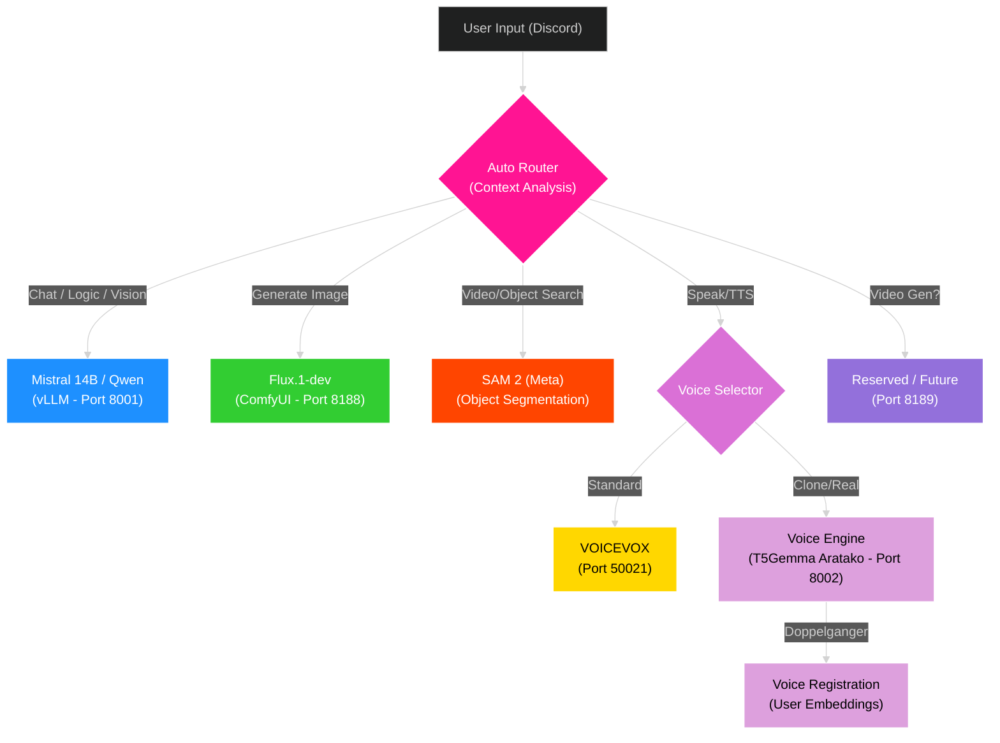

# ORA Discord Bot - Ultimate Edition 🌌
### *The Next-Generation AI Orchestrator for RTX 5090*

<div align="center">


[](https://discord.gg/YoneRai12)
[](https://www.python.org/)
[](https://github.com/vllm-project/vllm)
[](https://www.nvidia.com/)

<div align="center">

[](README.md)
[](README_JP.md)

</div>

</div>

---

## 🚀 Overview

ORA is a **fully autonomous AI Operating System** running locally on your hardware. It integrates the world's most advanced open-source models into a seamless, unified experience inside Discord.

### ✨ Why ORA? (Key Benefits)
- **💰 Zero Monthly Fees**: Unlike ChatGPT Plus ($20/mo) or Midjourney ($10/mo), ORA runs **100% locally**. You own the AI.
- **🔒 Complete Privacy**: No data leaves your PC. Your chats, images, and voice are processed on your RTX 5090.
- **⚡ High Performance**: Optimized for RTX 5090 (32GB VRAM), ensuring maximum speed and quality.

### 🌟 Technical Highlights
- **🧠 Dual-Architecture (Brain + Voice)**: 
    - **Main Brain**: `Ministral-3-14B` via **vLLM** (Logic, Tools, Vision).
    - **Voice Engine**: `T5Gemma-TTS` via **Services** (Voice Cloning, Speech).
- **🗣️ Doppelganger Mode**: Can clone and speak with YOUR voice (Zero-Shot Cloning).
- **👁️ True Vision (Native)**: Can see video and images directly through the Main Brain.
- **🎨 Hollywood-Grade Art**: Generates 4K images using **FLUX.2** (State of the Art).
- **🎮 Zero-Latency Gaming**: Automatically detects games (Apex/Valorant) and shrinks VRAM usage to save FPS.

---

## 💡 Practical Use Cases

| Scenario | How ORA Helps |
| :--- | :--- |
| **🤖 Gaming Companion** | "Hey ORA, look at my screen. Where is the enemy?" (Vision) |
| **🎨 Creative Studio** | "Generate a Youtube thumbnail for Minecraft, anime style." (Image Gen) |
| **👯 Doppelganger** | "Clone my voice from this audio file." (Voice Cloning) |
| **📚 Homework Helper** | "Solve this calculus problem step-by-step." (Reasoning Model) |
| **🎙️ Vtuber / Stream** | Can act as a fully voiced co-host that reads chat and responds. |
| **🔍 Research** | "Search the web for RTX 5090 benchmarks and summarize." (Tools) |

---

## 🏗️ System Architecture (Logic Flow)

This system uses an **Automatic Semantic Router** to dynamically assign tasks to the most appropriate AI model.



### 🧩 Component Breakdown

| Feature | Model / Engine | Provider | Status |
| :--- | :--- | :--- | :--- |
| **LLM (Brain)** | `Ministral-3-14B` | vLLM (Local) | 🟢 Active |
| **Vision (Eyes)** | `Qwen3-VL` (Native) | vLLM (Local) | 🟢 Active |
| **Image Gen** | `Flux.1-dev` (FP8) | ComfyUI | 🟢 Active |
| **Video Rec** | `SAM 2` (Segment Anything) | Meta (Facebook) | 🟡 Loaded |
| **TTS (Std)** | `VOICEVOX` | Docker / Local | 🟢 Active |
| **TTS (Real)** | `Aratako_T5Gemma-TTS` | Transformers | 🟢 Active (Port 8002) |

This architecture ensures high performance by loading heavy models (like Flux or SAM 2) only when needed, while the core LLM handles the orchestration.

---

## 💻 Installation & Usage

### 1. Model Setup (First Time)
Run the downloader to fetch the Voice Engine weights (~10GB):
```powershell
python download_triad_models.py
```

### 2. Launching ORA
1.  **Start Services**: Double-click `start_services.bat`.
    -   Launches **Voice Engine** (T5Gemma) on Port 8002.
2.  **Start Launcher**: Right-Click Desktop -> **"Start ORA Bot"**.
    -   Launches **vLLM** (Brain) and **ComfyUI** (Image).

### Manual Modes
If launching via `start_vllm.bat`:
- **[1] Normal**: Full power (Mistral/Qwen 30B).
- **[2] Thinking**: Forces Reasoning model.
- **[3] Gaming**: Low-VRAM mode (7B Model).

---

## ⚙️ Configuration & Customization

You can tweak ORA's behavior in `src/config.py` or `.env`.

### Environment Variables
| Variable | Description | Default |
| :--- | :--- | :--- |
| `ORA_DEV_GUILD_ID` | Server ID for Slash Commands (Global if empty) | None |
| `SD_API_URL` | URL for ComfyUI/SD Backend | `http://localhost:8188` |
| `LLM_API_URL` | URL for vLLM Backend | `http://localhost:8001/v1` |
| `VOICE_ENGINE_URL` | URL for T5Gemma TTS | `http://localhost:8002` |

---

## 📚 Detailed Command List

### 🎨 Image Generation
`/imagine [prompt] [style] [resolution]`
-   **Prompt**: "A cyberpunk city at night".
-   **Style**: "Anime", "Photo", "Oil Painting" (Auto-detected if omitted).
-   **Resolution**: FHD, 4K, Ultrawide.
> **Note**: ORA uses FLUX.2, which follows prompts *exactly*.

### 👁️ Vision Analysis
`/analyze [image/video]`
-   Upload a file and ask "What is happening here?".
-   Use "Solve this" for math homework.
-   Use "Who is this?" for character recognition.

### 🗣️ Voice & Cloning
`/join` / `/leave`
-   **Auto-Read**: Reads chat messages via TTS.
-   `/doppelganger [audio]`: **Registers your voice.** ORA will start speaking with YOUR voice.
-   `/listen`: Talk to ORA directly. She hears you!

### 🔧 Tools & Utilities
-   `/search`: Google Search.
-   `/timer`: Set alarms.
-   `/system`: VRAM/Temp monitor.
-   `/shiritori`: Play games.

---

## ❓ Troubleshooting

### "System Swapping / Laggy"
-   **Cause**: vLLM default VRAM reservation (90%) leaves no room for Windows.
-   **Fix**: Launcher sets `gpu-memory-utilization` to 0.60 (60%), fixing this. Restart the bot.

### "Bot starts but vLLM stops"
-   **Cause**: Port conflict. Bot tries to start its own vLLM.
-   **Fix**: Fixed in `ResourceManager` (Startup Adoption). Restart the bot.

### "Image Generation Failed"
-   **Cause**: ComfyUI not running.
-   **Fix**: Use the "Start ORA Bot" launcher (it starts Comfy automatically).

---

<div align="center">

**Developed by YoneRai12**
*Powered by the Bleeding Edge of AI*

</div>

---

# 🧠 RTX 5090 AI Training System

This repository now includes a specialized module for fine-tuning ORA's brain (`Mistral-3-14B-Instruct`) natively on Windows using the RTX 5090.

## 🎯 Phase 18: Tool Mastery (LoRA Curriculum)
We are fine-tuning the model to master specific Discord operations without prompting:
1.  **Identity**: Recall "I am ORA, created by YoneRai12."
2.  **Tool Use**: Precisely outputting JSON for `generate_image`, `web_search`, `doppelganger`.
3.  **Moderation**: Precision use of `ban_user`, `kick_user`.

## ⚙️ Technical Specs (Blackwell Optimized)
-   **Model**: `mistralai/Ministral-3-14B-Instruct-2512`
-   **Method**: QLoRA (4-bit NF4 Quantization)
-   **Precision**: BFloat16 (Native Mixed Precision for RTX 5090)
-   **Stack**: Pure PyTorch Nightly (CUDA 12.8) + BitsAndBytes Windows

## 🚀 How to Train
1.  **Generate Data**:
    ```powershell
    python src/training/prepare_tool_data.py
    ```
    *(Generates 1,000 synthetic `User -> Thought -> Tool` samples)*

2.  **Start Training**:
    ```powershell
    cd RTX5090-DebugSystem-main
    start_training.bat
    ```
    *(Auto-monitors VRAM and Loss convergence)*
