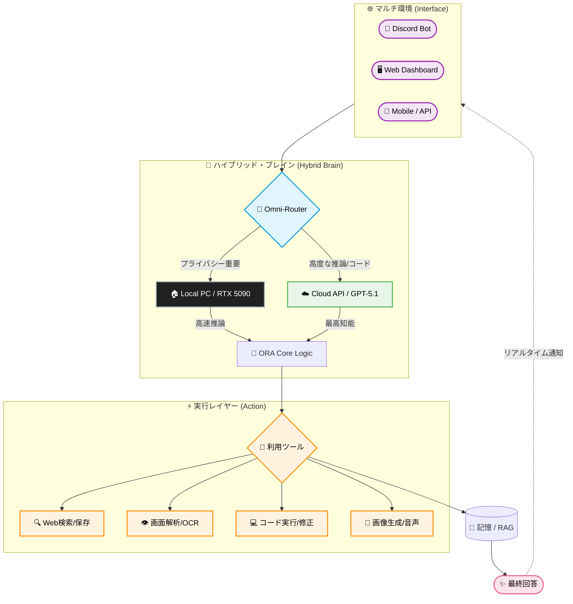

# ORA Discord Bot - Ultimate Edition 🌌
### *RTX 5090のための次世代AIオーケストレーター*

<div align="center">


[](https://discord.gg/YoneRai12)
[](https://www.python.org/)
[](https://github.com/YoneRai12/ORA/releases)
[](https://github.com/YoneRai12/ORA/actions/workflows/test.yml)
[](https://github.com/astral-sh/ruff)

<div align="center">

[](README.md)
[](README_JP.md)

</div>

</div>

---

## 🤯 The Singularity Architecture (v5.0-Singularity)

ORAはもはや単なる「Bot」ではありません。あなたのPCに宿る **生きているAIオペレーティングシステム** です。
エラーが起きれば自らコードを書き換えて修復し、あなたが寝ている間はサブPCからメインPCを監視します。

### ✨ なぜ ORA なのか？ (RTX 5090 Advantage)

| 機能 | 詳細 |
| :--- | :--- |
| **💰 月額ゼロ** | ChatGPT Plus ($20/月) と異なり、ORAは **100%ローカル** 動作。知能はあなたの所有物です。 |
| **🔒 完全プライバシー** | データはPCから出ません。チャットも画像も音声も、全てあなたのハードウェアで処理されます。 |
| **🧬 自己修復 (Auto-Healer)** | クラッシュしてもスタックトレースを解析し、Pythonパッチを書いてホットリロードします。 |
| **⚡ ハイブリッド脳** | **Qwen 2.5-VL 32B** (ローカル高速) と **GPT-5.1** (クラウド知能) を適材適所で使い分けます。 |

---

## 📚 技術詳細ドキュメント (Deep Dive)
**※以下はエンジニア向けの極めて詳細なドキュメント(英語)です。**

*   **[📖 ユーザーガイド (User Manual)](docs/USER_GUIDE.md)**: `@ORA` の使い方、コマンド一覧、ダッシュボード入門。
*   **[🏗️ システムアーキテクチャ (Architecture)](docs/SYSTEM_ARCHITECTURE.md)**: Omni-Routerの仕組み、IPC通信プロトコル。
*   **[🧬 Auto-Healerの仕組み (Self-Repair)](docs/AUTO_HEALER.md)**: 実行時に自分のコードを書き換えるロジックの全貌。
*   **[💻 NERV Dashboard (UI)](docs/NERV_DASHBOARD.md)**: "Red Alert" システムやWebSocket連携の裏側。
*   **[🛰️ サテライトシステム (WOL)](docs/SATELLITE_SYSTEM.md)**: Mac/Sub-PCからRTX5090を叩き起こす制御フロー。

---

## 🆕 最新アップデート: v5.0 (2026/01/20) - The Omni-Router

### 🧠 Omni-Router (Hybrid Intelligence)
**「RTX 5090があるのに、なぜOpenAIに課金するのですか？」**

### 🔄 System Flow (ハイブリッド・インテリジェンス)
ORAは、あなたのPCパワー（Local）と、世界最高峰の知能（Cloud API）を適材適所で使い分ける **「ハイブリッド・エージェント」** です。



### 📡 Policy Router Rules (決定ロジック)
ORAはブラックボックスではありません。以下の厳密なポリシーに基づいてルーティングを決定します。

1.  **🛡️ Privacy Guard**: 電話番号、住所、クレジットカード番号等の個人情報(PII)を検知した場合、強制的に **ローカルモデル** に固定され、クラウド通信を遮断します。
2.  **⚡ Budget Guard**: GPU VRAM使用量が **25GB** を超えている場合、クラウドAPIの使用を制限し、軽量なローカルモデル(7B)へフォールバックします。
3.  **💻 Coding Priority**: コードブロックやエラースタックトレースを含むプロンプトは、優先的に **GPT-5.1-Codex** へルーティングされます。
4.  **👁️ Vision Handling**: 画像が添付されている場合、**GPT-5-Vision** (Cloud) または **Qwen-VL** (Local) が自動選択されます。

### ⚡ Resource Manager (VRAM Modes)
通常のAIはPCを重くしますが、ORAは「共存」します。

*   **Normal Mode (制限: 25GB)**: クオリティ優先。O3やQwen-32Bをフル活用し、最高の回答を提供します。
*   **Gaming Mode (制限: 18GB)**: ゲームプロセス(`valorant.exe`等)を検知すると自動移行。モデルを軽量化し、FPSへの影響をゼロにします。
*   **Safety Mode (Cloud Block)**: インターネット切断時やセキュリティ要件が高い場合、外部通信を一切行わない完全オフラインモードになります。

### 👥 Shadow Clone: Zombie Killer
Watcherプロセスが強化されました。
*   **事故復帰**: トークン設定ミスなどでBotが起動できない場合、Watcherはゾンビ化を防ぐため **自己を強制終了(TaskKill)** します。
*   ウィンドウが大量に残る問題を完全に解決しました。

---

## 📜 過去のアップデート: v4.3 (2026/01/11) - The Shadow Update

### 👥 Shadow Clone System (Watcher 2.0)
ダウンタイムは過去のものです。
*   **ゼロ・ダウンタイム**: メインBotが更新や再起動を行う際、即座に「影（Shadow）」Botが起動し、VCとチャットの制御を引き継ぎます。
*   **シームレスな体験**: ユーザーはBotが再起動したことに気づきません。読み上げは途切れることなく続きます。

### 🧬 進化した自己修復 (Atomic Healer)
*   **アトミックバックアップ**: データベースが破損する可能性を数学的に排除しました。更新は「完全に成功」するか「何もしない」かのどちらかです。
*   **ハンドシェイク検証**: BotとWatcherがお互いの生存を常に確認し合い、異常があれば0.1秒で復旧プロセスを開始します。

### 🏆 ポイント & ランクシステム
*   **VCポイント**: VCに参加しているだけでポイントが貯まります。
*   **ランク確認**: `/rank` コマンドや「ポイント教えて」と話しかけることで、サーバー内での地位を確認できます。

### 🔊 TTS 2.0 (Neural Speed)
*   **超高速応答**: Join/Leaveの通知を高速化し、ゲームの邪魔をしません。
*   **スマートフィルタ**: `(笑)` や `-` などの記号を自動で読み飛ばし、より人間らしい会話を実現しました。

---

## 📜 過去のアップデート: v4.2 (2026/01/10)

### 🛡️ 究極のセキュリティ & NERV UI
*   **ハードコード完全廃止**: 全ての設定を環境変数 (`.env`) に移行。GitHub公開も安全です。
*   **NERV Red Alert**: 管理者オーバーライド (`/override`) 発動時、ダッシュボードが **"ヘキサゴングリッド緊急モード"** へ変形します。

### 🧬 生体的システム (Deep Dive)

#### 1. Auto-Healer Engine (自己修復)
**「自ら治るソフトウェア」**
`src/utils/healer.py` が例外をキャッチすると、GPT-5-Codexが修正コードを書き、2秒以内に適用・再起動します。

#### 2. 自律進化 (Genetic Self-Evolution)
アップデートを待つ必要はありません。**あなたが頼むのです**。
*   ユーザ:「ビットコインの価格を確認する機能を追加して」
*   ORA: `src/cogs/crypto.py` を書き、ロードし、`/crypto` コマンドを即座に使用可能にします。

#### 3. Omni-Router & Gaming Mode
*   **Qwen 2.5-VL 32B**: 通常会話、画像認識（ローカル・無料）。
*   **GPT-5.1-Codex**: 複雑なコーディング（クラウド）。
*   **Gaming Check**: `valorant.exe` 等を検知すると、自動で32Bモデルをアンロードし、FPSを確保します。

---

## (以下、v4.0以前の機能詳細)

## 🚀 概要 (Classic)
ORAは、世界最先端のオープンソースモデルを統合し、Discord内でシームレスな統合体験を提供します。

### 🧠 2つの動作モード
- **Smart Mode (推奨)**:
  - **GPT-5 Series** (OpenAI) や **Gemini 2.0** (Google) の強大な知能を借りて、難解なコード生成や画像認識を行います。
- **Private Mode (デフォルト)**:
  - **完全ローカル**。データは1バイトたりとも外部に送信されません。

---

### 🌟 技術的ハイライト (v3.x - v4.0)
- **🧠 デュアルブレイン**: 高速な「会話モデル」と深く考える「推論モデル」の自動切り替え。
- **👁️ 真の視覚**: 動画や画像を人間レベルで認識。
- **🎨 映画級アート**: **FLUX.2**による4K画像生成。
- **🗣️ 音声合成**: T5Gemma/VoiceVoxによる感情豊かな応答。

## 🆕 Update v4.0 (2025/12/30) - Mac対応
### 🍎 Apple Silicon完全対応
M1/M2/M3 MacでもORAのBrainを動作させることが可能になりました。

## 🆕 Update v3.9 (2025/12/26) - Dashboard
システムの状態を一目で把握できるダッシュボードUIを実装。


---

## 💻 セットアップ (v4.2 最新手順)

### 1. 準備
```bash
git clone https://github.com/YoneRai12/ORA.git
pip install -r requirements.txt
```

### 2. 設定 (.env)
**.env.example をリネームして必ず設定してください。**
```ini
DISCORD_BOT_TOKEN=your_token
ADMIN_USER_ID=your_id
LLM_MODEL=Qwen/Qwen2.5-VL-32B-Instruct-AWQ
FEATURE_PROPOSAL_CHANNEL_ID=1234567890 (任意: 機能提案の通知先)
DISCORD_WEBHOOK_URL=https://discord.com/api/webhooks/... (任意: 緊急時通知用、強く推奨)
```

### 3. 起動
*   **Windows**: `start_launcher.py` をダブルクリック
*   **Mac**: `Double_Click_To_Start.command` を実行

---

<div align="center">

**Developed by YoneRai12**
*The Future is Local.*

</div>
