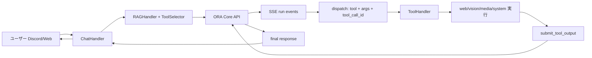

<div align="center">

# ORA (v5.0-Singularity) 🌌
### **The Artificial Lifeform AI System for High-End PC**


[](https://github.com/YoneRai12/ORA/releases)
[](https://github.com/YoneRai12/ORA/actions/workflows/test.yml)
[](https://discord.gg/YoneRai12)
[](LICENSE)

[**[📖 Manual]**](docs/USER_GUIDE.md) | [**[📂 Releases]**](https://github.com/YoneRai12/ORA/releases) | [**[🌐 Dashboard]**](http://localhost:3000)

---

[English](README.md) | [**日本語**](README_JP.md)

</div>

---

## 🌌 ORA とは？

ORAはもはや単なる「Bot」ではありません。あなたのPCに宿る **生きているAIオペレーティングシステム** です。
RTX 5090のパワーを極限まで引き出し、自己修復、自律進化、マルチモーダル認識を統合した、究極のパーソナルAI体験を提供します。

### 🚀 主要な特徴

*   **⚡ ハイブリッド知能**: **Qwen 2.5-VL** (ローカル高速) と **GPT-5.1** (クラウド知能) を自動ルーティング。
*   **🧬 自己修復 (Auto-Healer)**: エラーを自ら解析し、Pythonコードを書き換えてホットリロード。
*   **👁️ 真の視覚**: ゲーム画面やデスクトップをリアルタイムで認識し、対話。
*   **🔒 プライバシー重視**: 個人情報はローカルで処理。データはあなたの管理下にあります。

### 📊 モジュール稼働ステータス

| カテゴリ | 機能 | ステータス | 詳細 |
| :--- | :--- | :--- | :--- |
| **Thinking** | Omni-Router (Intent) | ✅ 安定 | 文脈に応じた自動推論 |
| **Visual** | Vision / OCR | ✅ 安定 | 画面キャプチャ・解析 |
| **System** | Auto-Healer | 🛠️ 開発中 | 自己修正・GitHub連携 |
| **Media** | Image Gen / Video | ✅ 安定 | FLUX.2 / yt-dlp 連携 |
| **Platform** | Windows / Mac / Web | ✅ 動作中 | 次世代マルチ環境対応 |

---

## 📚 技術詳細ドキュメント (Deep Dive)
**※以下はエンジニア向けの極めて詳細なドキュメント(英語)です。**

*   **[📖 ユーザーガイド (User Manual)](docs/USER_GUIDE.md)**: `@ORA` の使い方、コマンド一覧、ダッシュボード入門。
*   **[🏗️ システムアーキテクチャ (Architecture)](docs/SYSTEM_ARCHITECTURE.md)**: Omni-Routerの仕組み、IPC通信プロトコル。
*   **[🧬 Auto-Healerの仕組み (Self-Repair)](docs/AUTO_HEALER.md)**: 実行時に自分のコードを書き換えるロジックの全貌。
*   **[💻 NERV Dashboard (UI)](docs/NERV_DASHBOARD.md)**: "Red Alert" システムやWebSocket連携の裏側。
*   **[🛰️ サテライトシステム (WOL)](docs/SATELLITE_SYSTEM.md)**: Mac/Sub-PCからRTX5090を叩き起こす制御フロー。

---

## 🧭 現在のシステムフロー（実装準拠）

ORA は現在、**Hub/Spoke 構成**で動作しています。
- `ChatHandler` が Discord/Web の入力を受け、文脈・添付・利用可能ツールを整形
- `RAGHandler` と `ToolSelector` が補助情報とツール候補を選定
- `ORA Core API` が推論ループを実行し、必要ツールを `dispatch`
- クライアント側 `ToolHandler` が実行し、`/v1/runs/{id}/results` で Core に返却
- Core が続行して最終回答を返す

### 🔄 End-to-End フロー図


### 🏗️ アーキテクチャ概要図
```mermaid
flowchart TD
    subgraph Client["Client Layer"]
        CH[ChatHandler]
        VH[VisionHandler]
        TS[ToolSelector]
        RH[RAGHandler]
        TH[ToolHandler]
    end

    subgraph Core["Core Layer"]
        MSG[/POST /v1/messages/]
        RUN[MainProcess loop]
        EV[/GET /v1/runs/{id}/events/]
        RES[/POST /v1/runs/{id}/results/]
        DB[(SQLite: runs/messages/tool_calls)]
    end

    CH --> VH
    CH --> TS
    CH --> RH
    CH --> MSG
    MSG --> RUN
    RUN --> DB
    RUN --> EV
    EV --> CH
    CH --> TH
    TH --> RES
    RES --> RUN
```

### 実装上のポイント
1. プラットフォーム情報（source/guild/channel/admin など）を Core に明示的に渡す
2. 高難度判定時は plan-first（先に実行計画）を強制可能
3. 画像入力は canonical な `image_url` 形式に正規化
4. `web_download` は Discord 容量上限を考慮し、30分限定DLページ発行に対応
5. CAPTCHA 検知時は回避ではなく、戦略切替（API検索など）へ移行

### 👥 Shadow Clone: Zombie Killer
Watcherプロセスが強化されました。
*   **事故復帰**: トークン設定ミスなどでBotが起動できない場合、Watcherはゾンビ化を防ぐため **自己を強制終了(TaskKill)** します。
*   ウィンドウが大量に残る問題を完全に解決しました。

---

## 📜 過去のアップデート: v4.3 (2026/01/11) - The Shadow Update

### 👥 Shadow Clone System (Watcher 2.0)
ダウンタイムは過去のものです。
*   **ゼロ・ダウンタイム**: メインBotが更新や再起動を行う際、即座に「影（Shadow）」Botが起動し、VCとチャットの制御を引き継ぎます。
*   **シームレスな体験**: ユーザーはBotが再起動したことに気づきません。読み上げは途切れることなく続きます。

### 🧬 進化した自己修復 (Atomic Healer)
*   **アトミックバックアップ**: データベースが破損する可能性を数学的に排除しました。更新は「完全に成功」するか「何もしない」かのどちらかです。
*   **ハンドシェイク検証**: BotとWatcherがお互いの生存を常に確認し合い、異常があれば0.1秒で復旧プロセスを開始します。

### 🏆 ポイント & ランクシステム
*   **VCポイント**: VCに参加しているだけでポイントが貯まります。
*   **ランク確認**: `/rank` コマンドや「ポイント教えて」と話しかけることで、サーバー内での地位を確認できます。

### 🔊 TTS 2.0 (Neural Speed)
*   **超高速応答**: Join/Leaveの通知を高速化し、ゲームの邪魔をしません。
*   **スマートフィルタ**: `(笑)` や `-` などの記号を自動で読み飛ばし、より人間らしい会話を実現しました。

---

## 📜 過去のアップデート: v4.2 (2026/01/10)

### 🛡️ 究極のセキュリティ & NERV UI
*   **ハードコード完全廃止**: 全ての設定を環境変数 (`.env`) に移行。GitHub公開も安全です。
*   **NERV Red Alert**: 管理者オーバーライド (`/override`) 発動時、ダッシュボードが **"ヘキサゴングリッド緊急モード"** へ変形します。

### 🧬 生体的システム (Deep Dive)

#### 1. Auto-Healer Engine (自己修復)
**「自ら治るソフトウェア」**
`src/utils/healer.py` が例外をキャッチすると、GPT-5-Codexが修正コードを書き、2秒以内に適用・再起動します。

#### 2. 自律進化 (Genetic Self-Evolution)
アップデートを待つ必要はありません。**あなたが頼むのです**。
*   ユーザ:「ビットコインの価格を確認する機能を追加して」
*   ORA: `src/cogs/crypto.py` を書き、ロードし、`/crypto` コマンドを即座に使用可能にします。

#### 3. Omni-Router & Gaming Mode
*   **Qwen 2.5-VL 32B**: 通常会話、画像認識（ローカル・無料）。
*   **GPT-5.1-Codex**: 複雑なコーディング（クラウド）。
*   **Gaming Check**: `valorant.exe` 等を検知すると、自動で32Bモデルをアンロードし、FPSを確保します。

---

## (以下、v4.0以前の機能詳細)

## 🚀 概要 (Classic)
ORAは、世界最先端のオープンソースモデルを統合し、Discord内でシームレスな統合体験を提供します。

### 🧠 2つの動作モード
- **Smart Mode (推奨)**:
  - **GPT-5 Series** (OpenAI) や **Gemini 2.0** (Google) の強大な知能を借りて、難解なコード生成や画像認識を行います。
- **Private Mode (デフォルト)**:
  - **完全ローカル**。データは1バイトたりとも外部に送信されません。

---

### 🌟 技術的ハイライト (v3.x - v4.0)
- **🧠 デュアルブレイン**: 高速な「会話モデル」と深く考える「推論モデル」の自動切り替え。
- **👁️ 真の視覚**: 動画や画像を人間レベルで認識。
- **🎨 映画級アート**: **FLUX.2**による4K画像生成。
- **🗣️ 音声合成**: T5Gemma/VoiceVoxによる感情豊かな応答。

## 🆕 Update v4.0 (2025/12/30) - Mac対応
### 🍎 Apple Silicon完全対応
M1/M2/M3 MacでもORAのBrainを動作させることが可能になりました。

## 🆕 Update v3.9 (2025/12/26) - Dashboard
システムの状態を一目で把握できるダッシュボードUIを実装。


---

## 💻 セットアップ (v4.2 最新手順)

### 1. 準備
```bash
git clone https://github.com/YoneRai12/ORA.git
pip install -r requirements.txt
```

### 2. 設定 (.env)
**.env.example をリネームして必ず設定してください。**
```ini
DISCORD_BOT_TOKEN=your_token
ADMIN_USER_ID=your_id
LLM_MODEL=Qwen/Qwen2.5-VL-32B-Instruct-AWQ
FEATURE_PROPOSAL_CHANNEL_ID=1234567890 (任意: 機能提案の通知先)
DISCORD_WEBHOOK_URL=https://discord.com/api/webhooks/... (任意: 緊急時通知用、強く推奨)
```

### 3. 起動
*   **Windows**: `start_launcher.py` をダブルクリック
*   **Mac**: `Double_Click_To_Start.command` を実行

---

## 🔁 再現可能な検証手順 / バージョン運用

### CIと同じローカル検証
```bash
python -m venv .venv
source .venv/bin/activate  # Windows: .venv\\Scripts\\activate
pip install -U pip
pip install -r requirements.txt
pip install ruff mypy pytest pytest-asyncio

ruff check .
mypy src/ --ignore-missing-imports
python -m compileall src/
pytest tests/test_smoke.py
```

### GitHub Release運用ルール
1. `VERSION` を SemVer (`X.Y.Z`) で更新
2. Changelog を更新
3. タグ `vX.Y.Z` を作成して push

```bash
python scripts/verify_version.py --tag v5.0.0
git tag v5.0.0
git push origin v5.0.0
```

`release.yml` はタグと `VERSION` が一致しないと失敗するため、他者でも同じ手順で再現できます。

---

<div align="center">

**Developed by YoneRai12**
*The Future is Local.*

</div>
