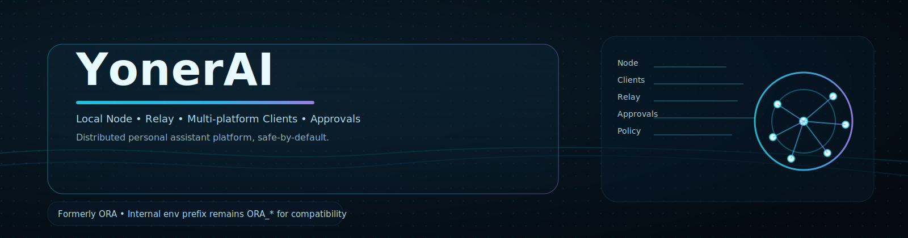

<div align="center">

# YonerAI
### **The Artificial Lifeform AI System（Node + Clients + Relay + Core）**



[](https://github.com/YoneRai12/YonerAI/releases)
[](https://github.com/YoneRai12/YonerAI/actions/workflows/test.yml)
[](https://discord.gg/YoneRai12)
[](LICENSE)

[**[Manual]**](docs/USER_GUIDE.md) | [**[Env Templates]**](docs/ENV_FILES.md) | [**[Release Notes]**](docs/RELEASE_NOTES.md) | [**[Web Chat]**](http://localhost:3000) | [**[Dashboard]**](http://localhost:3333)

---

[English](README.md) | [**日本語**](README_JP.md)

</div>

---

## YonerAI とは？

YonerAI（旧称: ORA）は Discord Bot / Web /（任意の）Core を組み合わせた、ローカルファーストのAIプラットフォームです。
ツール/スキル実行には危険度スコアリングと承認ゲートがあり、MCP（Model Context Protocol）で外部ツールサーバーも統合できます。

注: 内部のパスや環境変数は互換のため `ORA_*` 接頭辞を維持しています。プロダクト/リリースの名称は `PRODUCT_NAME` で管理します。

深掘りドキュメント:
- `docs/USER_GUIDE.md`
- `docs/SYSTEM_ARCHITECTURE.md`
- `docs/VPS_DEPLOYMENT.md`（VPS常時稼働の構成ガイド）
- `docs/DOMAIN_ROUTES.md`（`yonerai.com` のサブドメイン設計とAPIパス設計）
- `docs/PLATFORM_PLAN.md`（方向性: Node + Clients + Relay + Cloud）
- `docs/PLATFORM_REVIEW_AND_RISKS.md`（Devil's Advocate レビュー/リスク）
- `ORA_SYSTEM_SPEC.md`
- `AGENTS.md`（Codex/エージェント用のワークスペース指示）

---

## 構成要素

- Bot（Discord）: `python main.py`
- Admin Server（FastAPI）: `uvicorn src.web.app:app --host 0.0.0.0 --port 8000`
- Core（任意）: `python -m ora_core.main`（下記参照）
- Web Chat UI（Next.js）: `clients/web/`（既定 `http://localhost:3000`）
- Dashboard UI（Next.js）: `ora-ui/`（既定 `http://localhost:3333`）

---

## クイックスタート（Windows）

前提:
- Python 3.11
- Node.js（`clients/web` と `ora-ui`、一部スキルで使用）
- FFmpeg を `PATH` に追加（音声/音楽、一部メディア系スキル）

### 1) Bot
```powershell
python -m venv .venv
.venv\Scripts\Activate.ps1
pip install -U pip
pip install -r requirements.txt
Copy-Item .env.example .env
python main.py
```

最小必須の環境変数は `DISCORD_BOT_TOKEN` です。

### 2) Admin Server（任意）
```powershell
.venv\Scripts\Activate.ps1
uvicorn src.web.app:app --reload --host 0.0.0.0 --port 8000
```

### 3) Web UI（任意）
```powershell
cd clients\web
npm install
npm run dev
```

```powershell
cd ora-ui
npm install
npm run dev
```

### 4) Core（任意）
```powershell
$env:PYTHONPATH = "core\src"
python -m ora_core.main
```

補足:
- `start_all.bat` は便利ですが、PC固有のパスが含まれています。参考として自環境向けに調整してください。

---

## 設定（.env）

`.env.example` を元に `.env` を作成します。

必須:
- `DISCORD_BOT_TOKEN`

### WebセットアップUI（任意）

`.env` を直接編集したくない場合、ブラウザから secrets とURLを設定できます:

1. Adminサーバ起動:
   - `uvicorn src.web.app:app --reload --host 127.0.0.1 --port 8000`
2. ブラウザで開く:
   - `http://127.0.0.1:8000/setup`

このUIは profile別の `secrets/` と `state/settings_override.json` に保存します（`.env` をコミットしないため）。

推奨:
- `DISCORD_APP_ID`（Application ID）
- `ORA_DEV_GUILD_ID`（開発ギルド同期は即時、グローバル同期は最大で約1時間かかる場合あり）
- `ADMIN_USER_ID`（オーナー/作成者ID）

### 外部連携APIパス（トークン必須）

外部サービス連携で使う安定パス:

- `POST /api/v1/agent/run`
- `GET /api/v1/agent/runs/{run_id}/events`
- `POST /api/v1/agent/runs/{run_id}/results`

認証:
- `ORA_WEB_API_TOKEN` を設定
- `Authorization: Bearer <token>`（または `x-ora-token`）を送信

例:
```bash
curl -X POST "https://admin.yourdomain.com/api/v1/agent/run" \
  -H "Authorization: Bearer $ORA_WEB_API_TOKEN" \
  -H "Content-Type: application/json" \
  -d '{"prompt":"最新ステータスを要約して","user_id":"api-client-1"}'
```

よく触る項目:
- `OPENAI_API_KEY`（クラウドモデル）
- `LLM_BASE_URL`, `LLM_MODEL`（ローカル推論ゲートウェイ）
- `ORA_PUBLIC_TOOLS`, `ORA_SUBADMIN_TOOLS`（ツールの許可リスト）
- `ORA_APPROVAL_TIMEOUT_SEC` と監査ログ保持設定（承認 + audit）

---

## Skills（ローカルツール）

ORA には2系統のローカルツールがあります（どちらも ToolHandler 境界で実行されます）。

- 静的ツールレジストリ: `src/cogs/tools/registry.py`
  - 既存ツール（schema + 実装パス）を定義します。
- 動的スキル: `src/skills/<skill_name>/`
  - "Clawdbot pattern" 形式: `SKILL.md` + `tool.py`（+ 任意で `schema.json`）
  - `src/skills/loader.py` がロードし、`src/cogs/tools/tool_handler.py` が実行します。

スキルの基本構造:
- `src/skills/<name>/SKILL.md`（使い方 + 前提）
- `src/skills/<name>/tool.py`
  - `async def execute(args: dict, message: discord.Message, bot: Any = None) -> Any`
  - 任意: `TOOL_SCHEMA = {name, description, parameters, tags}`

例:
- `src/skills/remotion_create_video/`（`tools/remotion/` の Node 依存が必要）

### Remotion（動画レンダリング）

スキル: `remotion_create_video`

初回セットアップ:
```powershell
cd tools/remotion
npm ci
```

メモ:
- Node.js と `npx` が必要です。
- 任意の環境変数: `ORA_REMOTION_PROJECT_DIR`, `ORA_REMOTION_ENTRY`, `ORA_REMOTION_RENDER_TIMEOUT_SEC`

---

## MCP（Model Context Protocol）ツールサーバー

MCP は **デフォルト無効** です。有効化すると、stdio 経由で外部 MCP サーバーに接続し、リモートツールをローカルツールとして登録します。

- ツール名: `mcp__<server>__<tool>`
- ローダー: `src/cogs/mcp.py`
- 通信: `src/utils/mcp_client.py`（最小実装の MCP-over-stdio クライアント）

有効化例:
```ini
ORA_MCP_ENABLED=1
# servers は JSON 配列
# 各要素: name, command, cwd, env, allowed_tools, allow_dangerous_tools
ORA_MCP_SERVERS_JSON=[{"name":"artist","command":"python scripts/mock_mcp_artist.py","allowed_tools":["generate_artwork"]}]
```

`ORA_MCP_SERVERS_JSON` の代わりに、`config.yaml` の `mcp_servers`（同じオブジェクト形状）でも設定できます。

安全側の設定:
- `ORA_MCP_DENY_TOOL_PATTERNS`（危険そうな名前をデフォルト拒否）
- `ORA_MCP_ALLOW_DANGEROUS=0`（拒否を強制）

---

## 安全性（Risk, Approvals, Audit）

- Risk scoring: `src/utils/risk_scoring.py`
- 承認ゲート: `src/cogs/tools/tool_handler.py`
- 監査DB: `ora_bot.db`（`.env` の `ORA_AUDIT_RETENTION_DAYS` などで保持設定）

---

## 現在のシステムフロー（Hub + Spoke）

ORA は hub/spoke 構成で動作します:
- `ChatHandler` が入力と文脈を整形し、ツール露出を絞る
- `ORA Core API` が推論ループを主導し tool_call を発行
- Bot 側がツール実行し、結果を Core に返却

機能追加（tools/skills/MCP）を安全に増やすガイド: `docs/EXTENSIONS.md`

### End-to-End フロー（シーケンス）


Mermaid source: `docs/diagrams/e2e_request_path_sequence_jp.mmd` (light), `docs/diagrams/e2e_request_path_sequence_jp_dark.mmd` (dark)

---

### Relay ペアリング + Proxy 経路（シーケンス）


Mermaid source: `docs/diagrams/relay_pairing_and_proxy_jp.mmd` (light), `docs/diagrams/relay_pairing_and_proxy_jp_dark.mmd` (dark)

---

### ツールポリシー + 承認ゲート（フロー）


Mermaid source: `docs/diagrams/tool_policy_and_approvals_flow_jp.mmd` (light), `docs/diagrams/tool_policy_and_approvals_flow_jp_dark.mmd` (dark)

## 開発用チェック（CI相当）

```bash
python -m venv .venv
source .venv/bin/activate  # Windows: .venv\\Scripts\\activate
pip install -U pip
pip install -r requirements.txt
pip install ruff mypy pytest pytest-asyncio

ruff check .
mypy src/ --ignore-missing-imports
python -m compileall src/
pytest
```

---

## リリース運用

1. `VERSION` を SemVer（`X.Y.Z`）で更新
2. Changelog 更新
3. `vX.Y.Z` タグを作成して push

```bash
python scripts/verify_version.py --tag v5.1.8
git tag v5.1.8
git push origin v5.1.8
```

---

## ライセンス

MIT。`LICENSE` を参照。
