# 🏗️ ORA System Architecture (Internals)
### *Unveiling the Omni-Structure*

ORA is not a monolithic bot; it is a microservice-based **AI Operating System**.

---

## 🔄 The Omni-Router (The Brain Stem)
Located in `src/utils/unified_client.py`.
This module intercepts **every** user interaction and decides where to rout it.

### Routing Logic Flow:
1.  **Input Analysis**:
    *   **Text Density**: Is it a simple greeting or a complex essay?
    *   **Keywords**: "Python", "Error", "Fix" -> **Coding Score +50**.
    *   **Context**: Is there an image attachment? -> **Vision Path**.

2.  **Decision Matrix (`config.py`)**:
    *   **Score < 30**: Route to **Local Brain (Qwen 2.5)**. (Zero Cost, <300ms)
    *   **Score > 50**: Route to **Cloud Brain (GPT-5.1)**. (High Cost, ~2s)
    *   **Vision Intent**: Route to **Qwen-VL Native**.

### 📊 Visual Logic Flow

```mermaid
graph TD
    Input[Input Request] --> Router{Smart Router}
    
    %% Local Path
    Router -->|Privacy / Speed| Local[🏠 Local Brain]
    Local --> Qwen["Qwen 2.5-VL 32B"]
    
    %% Cloud Path
    Router -->|Coding / Complexity| Cloud[☁️ Cloud Brain]
    Cloud --> GPT["GPT-5.1-Codex / GPT-4o"]
    
    %% Tools
    Local --> Tools[🛠️ Tools]
    Cloud --> Tools
    
    Tools --> Image["🎨 Flux.1 Image"]
    Tools --> Vision["👁️ Screen Analyze"]
    Tools --> System["💻 PC Control"]

    %% Output
    Tools --> Response
    GPT --> Response
    Qwen --> Response["Final Response"]
    
    style Router fill:#ff0055,stroke:#fff,stroke-width:2px
    style Local fill:#00aaff,stroke:#fff
    style Cloud fill:#aa00ff,stroke:#fff
    style Response fill:#00ff00,stroke:#000
```

---

## 📡 Satellite IPC Protocol
Communication between the Main PC (RTX 5090) and Satellite (Mac) happens via a custom UDP/TCP handshake.

*   **Heartbeat**: Main PC sends a UDP "Pulse" every 5s.
*   **Wake Signal**: Satellite sends a Magic Packet (WoL) if Pulse is lost but Request is received.
*   **State Sync**: `rsync` keeps the Vector DB (`/ora_state`) synchronized between nodes.

---

## 💾 Memory Architecture (The Hippocampus)
ORA uses a **Tiered Memory System**:

1.  **Short-Term (RAM)**: Last 20 messages in current channel. Instant access.
2.  **Vector Store (ChromaDB)**: Semantic embeddings of all past conversations.
    *   *Query*: "What did we talk about last week?" -> Vector Search.
3.  **Long-Term (Summary)**: Periodically summarized "Core Memories" stored as pure JSON.

---

## 🛡️ The Auto-Healer Cycle
Refer to `docs/AUTO_HEALER.md` for the full biological breakdown.
Key files:
*   `src/utils/healer.py`: The Surgeon.
*   `src/utils/backup_manager.py`: The Safety Net.
*   `src/utils/health_inspector.py`: The Vital Monitor.

---

## ⚛️ Tech Stack Summary
| Component | Technology | Role |
| :--- | :--- | :--- |
| **Language** | Python 3.11 | Core Logic |
| **Web UI** | Next.js 15 + React | NERV Dashboard |
| **DB** | ChromaDB + SQLite | Memory |
| **Local LLM** | vLLM (Pytorch) | Inference Engine |
| **Vision** | Transformers (HuggingFace) | Eye |
| **IPC** | ZeroMQ / WebSocket | Inter-process Comms |
